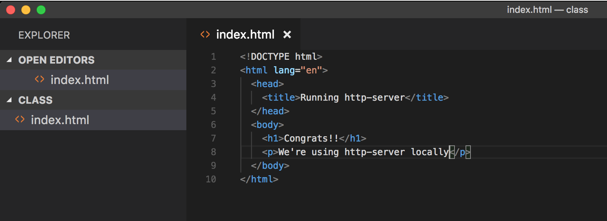
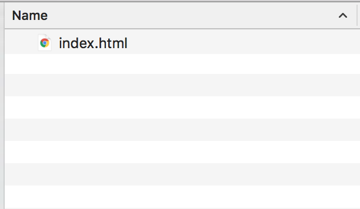
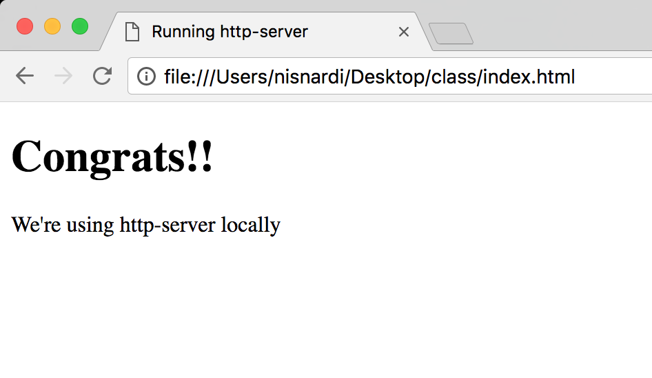
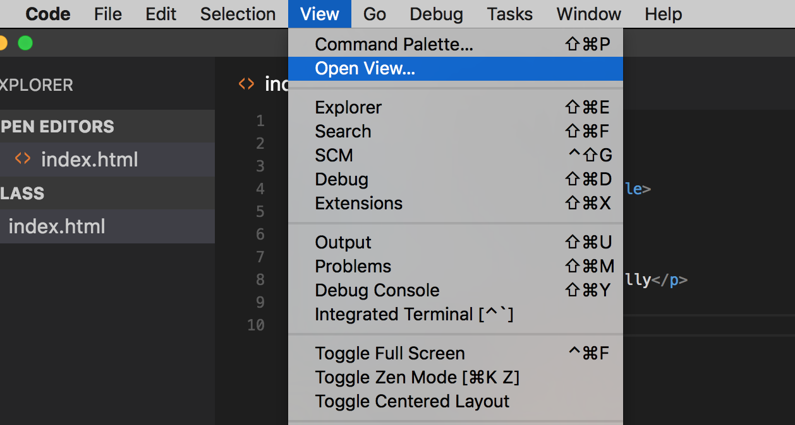
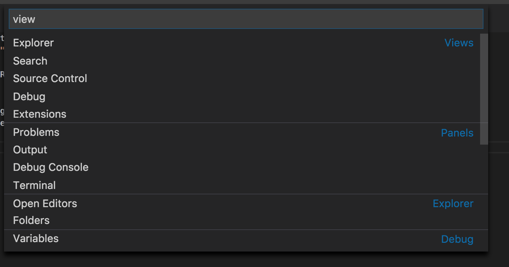
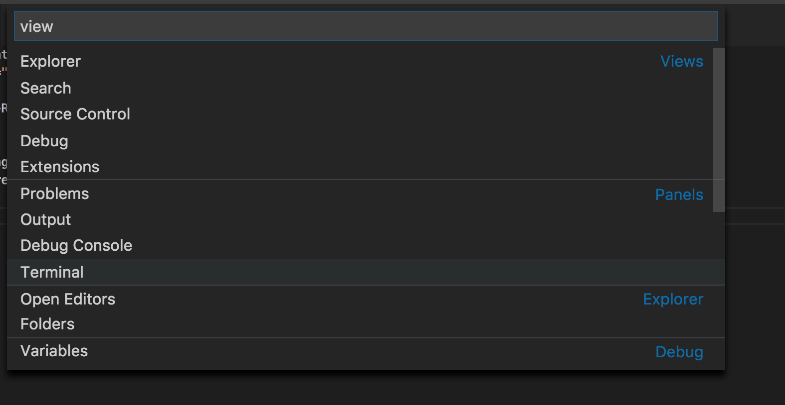
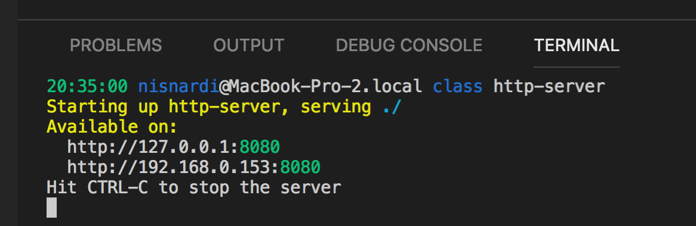
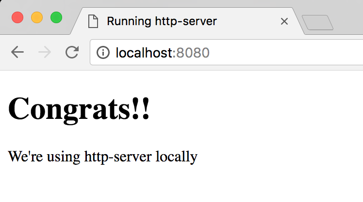

# Browser API

[<- Go Back](README.md)

# http-server
* **http-server** is a simple, zero-configuration command-line http server
* It is powerful enough for production usage, but it's simple and hackable enough to be used for testing, local development, and learning
* We're going to install http-server locally
* If you have Node.js installed execute the following command from your terminal

  ```bash
  npm install http-server -g
  ```

* We create an HTML file like always

  

* Usually you just double click the file

  

* And open it on a browser

  

* Now we are going to use the Visual Studio Code terminal
* Go to the main bar and select View > Open View

  

* You will see a couple of options

  

* Select the Terminal

  

* You will see the terminal view inside VSC
* If you opened the folder VSC already knows that we're using this path
* Type:
  ```bash
  http-server
  ```
* A new web server will start
* This server will serve the folder files
* So our site root is going to be our folder that we are using
* If everything is ok you see a message
* By default this server will run on port `8080`
* The port might change if you already have that port listening with other app

  

* Now open the browser again
* Navigate to `http://localhost:8080`
* At this moment you must see your index.html document

  

* Using http-server we have a local server running and we are able to simulate a real site
* From now on use http-server or similar to create your sites
* If you need to stop the server just press `CTRL + C`
* You can open the terminal using the following shortcut
  ```
  Ctrl+` 
  ```

* [http-server site](https://www.npmjs.com/package/http-server)
* [VSC keyboard shortcuts Windows](https://code.visualstudio.com/shortcuts/keyboard-shortcuts-windows.pdf)
* [VSC keyboard shortcuts Mac](https://code.visualstudio.com/shortcuts/keyboard-shortcuts-macos.pdf)

## How to execute JavaScript
* Using the browser we can execute JavaScript in the following ways:
  * Console
  * Inside script tag
  * External file using script tag
  
### Script Tag
* The HTML **script element** is used to embed or reference executable code
* Typically used to embed or refer to JavaScript code
* The script element can also be used with other languages, such as WebGL's GLSL shader programming language
* You can add the script tag inside the head element
* Also, you can add your script tag right before closing the body element
* The script tag and the way we load/execute our JavaScript can have some browser effects
* For now just know that you can place it in both elements (head & body)

  **Example:**
  ```html
  <head>
    <script>
      // You can add your JavaScript code here!
      console.log('Welcome to the Browser again!!');
    </script>
  </head>
  ```

  or

  **Example:**
  ```html
  <body>
    <h1>Hi</h1>
    <p>Add the script tag</p>
    
    <script>
      // You can add your JavaScript code here!
      console.log('Welcome to the Browser again!!');
    </script>
  </body>
  ```

#### Practice
[Exercise 1](./exercises/browser/ex_1.md)

### External file using script tag
* Using a **script tag** we can link our HTML file with a JavaScript one
* This is going to work in a similar way as the CSS files and the link tag
* Using the script tag `src` attribute we can set the external file value

**Example:**
* HTML code:

  ```html
  <head>
    <script src="script.js"></script>
  </head>
  ```

* Code inside the `script.js` file
  ```js
  // archivo script.js
  console.log('Welcome to the browser');
  ```

* When the browser finds a **script** tag will request the js file, download it and then execute it
* While this happens the browser is blocked from being able to keep on rendering the document
* This is one of the reasons why we use the script tag before the closing body one
* By doing this we show the HTML content and then execute the script
* Now the browsers supports `async` & `defer` attributes that allows us to tell the browser how it has to handle our script files

  **Example:**
  ```html
  <head>
    <script src="script.js" async></script>
  </head>
  ```
  or

  **Example:**
  ```html
  <head>
    <script src="script.js" defer></script>
  </head>
  ```

* These attributes tell the browser it's safe to continue parsing while the scripts are being downloaded
* Scripts with the `async` attribute are executed asynchronously
* This means the script is executed as soon as it's downloaded, without blocking the browser in the meantime
* This implies that it's possible that a second script is downloaded & executed before the first script
* Scripts with the `defer` attribute are executed in order (i.e. first script, then second and so on)
* Also does not block the browser
* Unlike async scripts, defer scripts are only executed after the entire document has been loaded
* You can learn more about async and defer on the following links
  * [Adding interactivity with JavaScript](https://developers.google.com/web/fundamentals/performance/critical-rendering-path/adding-interactivity-with-javascript)
  * [async vs defer](http://www.growingwiththeweb.com/2014/02/async-vs-defer-attributes.html)
  * [async vs defer - Video](https://www.youtube.com/watch?v=cCrfL84DkEk)

#### Practice
[Exercise 2](./exercises/browser/ex_2.md)
