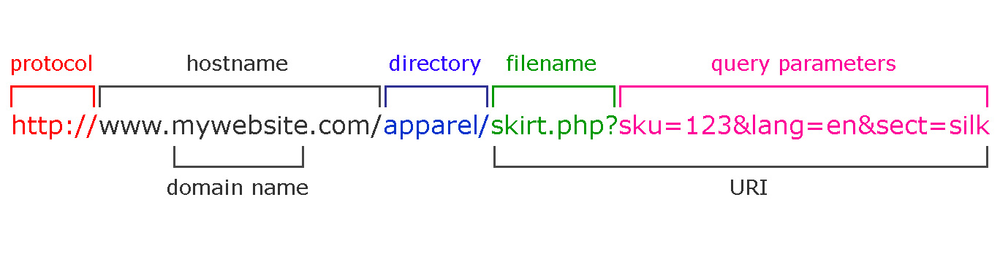
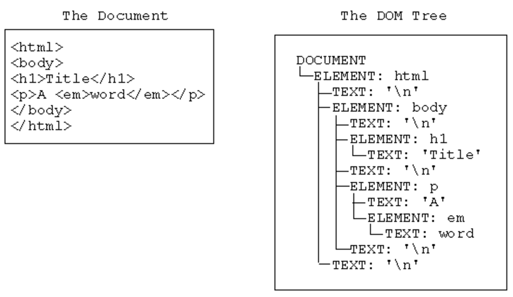

# Browser API

[<- Go Back](README.md)

# http-server
* **http-server** is a simple, zero-configuration command-line http server
* It is powerful enough for production usage, but it's simple and hackable enough to be used for testing, local development, and learning
* We're going to install http-server locally
* If you have Node.js installed execute the following command from your terminal

  ```bash
  npm install http-server -g
  ```

* We create an HTML file like always

  

* Usually you just double click the file

  

* And open it on a browser

  

* Now we are going to use the Visual Studio Code terminal
* Go to the main bar and select View > Open View

  

* You will see a couple of options

  

* Select the Terminal

  

* You will see the terminal view inside VSC
* If you opened the folder VSC already knows that we're using this path
* Type:
  ```bash
  http-server
  ```
* A new web server will start
* This server will serve the folder files
* So our site root is going to be our folder that we are using
* If everything is ok you see a message
* By default this server will run on port `8080`
* The port might change if you already have that port listening with other app

  

* Now open the browser again
* Navigate to `http://localhost:8080`
* At this moment you must see your index.html document

  

* Using http-server we have a local server running and we are able to simulate a real site
* From now on use http-server or similar to create your sites
* If you need to stop the server just press `CTRL + C`
* You can open the terminal using the following shortcut
  ```
  Ctrl+` 
  ```

* [http-server site](https://www.npmjs.com/package/http-server)
* [VSC keyboard shortcuts Windows](https://code.visualstudio.com/shortcuts/keyboard-shortcuts-windows.pdf)
* [VSC keyboard shortcuts Mac](https://code.visualstudio.com/shortcuts/keyboard-shortcuts-macos.pdf)

## How to execute JavaScript
* Using the browser we can execute JavaScript in the following ways:
  * Console
  * Inside script tag
  * External file using script tag
  
### Script Tag
* The HTML **script element** is used to embed or reference executable code
* Typically used to embed or refer to JavaScript code
* The script element can also be used with other languages, such as WebGL's GLSL shader programming language
* You can add the script tag inside the head element
* Also, you can add your script tag right before closing the body element
* The script tag and the way we load/execute our JavaScript can have some browser effects
* For now just know that you can place it in both elements (head & body)

  **Example:**
  ```html
  <head>
    <script>
      // You can add your JavaScript code here!
      console.log('Welcome to the Browser again!!');
    </script>
  </head>
  ```

  or

  **Example:**
  ```html
  <body>
    <h1>Hi</h1>
    <p>Add the script tag</p>
    
    <script>
      // You can add your JavaScript code here!
      console.log('Welcome to the Browser again!!');
    </script>
  </body>
  ```

#### Practice
[Exercise 1](./exercises/browser/ex_1.md)

### External file using script tag
* Using a **script tag** we can link our HTML file with a JavaScript one
* This is going to work in a similar way as the CSS files and the link tag
* Using the script tag `src` attribute we can set the external file value

**Example:**
* HTML code:

  ```html
  <head>
    <script src="script.js"></script>
  </head>
  ```

* Code inside the `script.js` file
  ```js
  // archivo script.js
  console.log('Welcome to the browser');
  ```

* When the browser finds a **script** tag will request the js file, download it and then execute it
* While this happens the browser is blocked from being able to keep on rendering the document
* This is one of the reasons why we use the script tag before the closing body one
* By doing this we show the HTML content and then execute the script
* Now the browsers supports `async` & `defer` attributes that allows us to tell the browser how it has to handle our script files

  **Example:**
  ```html
  <head>
    <script src="script.js" async></script>
  </head>
  ```
  or

  **Example:**
  ```html
  <head>
    <script src="script.js" defer></script>
  </head>
  ```

* These attributes tell the browser it's safe to continue parsing while the scripts are being downloaded
* Scripts with the `async` attribute are executed asynchronously
* This means the script is executed as soon as it's downloaded, without blocking the browser in the meantime
* This implies that it's possible that a second script is downloaded & executed before the first script
* Scripts with the `defer` attribute are executed in order (i.e. first script, then second and so on)
* Also does not block the browser
* Unlike async scripts, defer scripts are only executed after the entire document has been loaded
* You can learn more about async and defer on the following links
  * [Adding interactivity with JavaScript](https://developers.google.com/web/fundamentals/performance/critical-rendering-path/adding-interactivity-with-javascript)
  * [async vs defer](http://www.growingwiththeweb.com/2014/02/async-vs-defer-attributes.html)
  * [async vs defer - Video](https://www.youtube.com/watch?v=cCrfL84DkEk)

#### Practice
[Exercise 2](./exercises/browser/ex_2.md)
## User interaction
* Browsers have a **window** object that represents a window containing a DOM document
* This object has 3 methods that allows us to interact with the user: `alert, prompt & confirm`
* The browsers have already configured a reference so we can call this methods without the window object
* All this methods block the browser flow until they are resolved

  **Example:**
  ```js
  // Methods call using windows object:
  window.alert();
  window.prompt();
  window.confirm();

  // Using them as functions:
  alert();
  prompt();
  confirm();
  ```

### Alert
* The **Window.alert()** method displays an alert dialog with the optional specified content and an OK button
* This method accepts a message parameter that will show to the user

  **Example:**
  ```js
  window.alert('Hi I\'m using the browser');
  alert('How cool is that!!');
  ```

* [MDN alert doc](https://developer.mozilla.org/en-US/docs/Web/API/Window/alert)

#### Practice
[Exercise 3](./exercises/browser/ex_3.md)

### Prompt
* The **Window.prompt()** displays a dialog with an optional message prompting the user to input some text
* This method accepts 2 parameter
* First parameter is the message that we'll show the user
* Second parameter is optional and is the input default value
* This method returns a `string` value

  **Example:**
  ```js
  let name = window.prompt('Please input your name');
  let superHero = prompt('Please input your favourite superheroe name');
  ```

* [MDN prompt doc](https://developer.mozilla.org/en-US/docs/Web/API/Window/prompt)

#### Practice
[Exercise 4](./exercises/browser/ex_4.md)

[Exercise 5](./exercises/browser/ex_5.md)

### Confirm
* The **Window.confirm()** method displays a modal dialog with an optional message and two buttons, OK and Cancel
* This method accepts a string parameter that will show to the user
* This method returns a `boolean` value
* If the user press Ok we get `true` back
* Else we get `false` back

  **Example:**
  ```js
  let isAdult = window.confirm('Are you older than 17 years?');
  confirm('Are you older than 17 years?');
  ```

* [MDN confirm doc](https://developer.mozilla.org/en-US/docs/Web/API/Window/confirm)

#### Practice
[Exercise 6](./exercises/browser/ex_6.md)

[Exercise 7](./exercises/browser/ex_7.md)

[Exercise 8](./exercises/browser/ex_8.md)

* [MDN script tag doc](https://developer.mozilla.org/en-US/docs/Web/HTML/Element/script)

## Location
* The **location** interface `represents the location (URL`) of the object it is linked to
* Document and Window interface have a location
* We can access it using `document.location` and `window.location`

  **Example:**
  ```js
  // We can use it as a window or document property
  window.location
  document.location

  // Just using location
  location
  ```

* Take a look at a URL structure

  

* The location interface has properties that represent the different parts of a URL
  * **href**
  * **protocol**
  * **host**
  * **hostname**
  * **port**
  * **pathname**
  * **search**
  * **hash**

  **Example:**
  ```js
  location.href;
  location.protocol;
  location.host;
  location.hostname;
  location.port;
  location.pathname;
  location.search;
  location.hash;
  ```

* You can try it too, go to a site page like facebook or a news site and log each property using console.log and see the result
* For example consider the following URL:
  ```
  https://leaderpost.com/sports/football/cfl/saskatchewan-roughriders/rider-rumblings-66-a-truly-classic-labour-day-game#go-riders
  ```

  **Example:**
  ```js
  console.log(location.href);     // https://leaderpost.com/sports/football/cfl/saskatchewan-roughriders/rider-rumblings-66-a-truly-classic-labour-day-game#go-riders
  console.log(location.protocol); // https:
  console.log(location.host);     // leaderpost.com
  console.log(location.hostname); // leaderpost.com
  console.log(location.port);     // empty string as it doesn't have a port number
  console.log(location.pathname); // /sports/football/cfl/saskatchewan-roughriders/rider-rumblings-66-a-truly-classic-labour-day-game
  console.log(location.search);   // empty string as we don't have a query string params (you can try this submiting a form using GET)
  console.log(location.hash);     // #go-riders
  ```

* Host and Hostname look the same as this url is using the default port number
* Host retrieves the full host value (with port)
* Hostname just retrieves the full host name
* As you can see using location we can get all the URL components
* Also, we can set a location value using the href property
* As we change the document/window location the browser will navigate to the new location

  **Example:**
  ```js
  location.href = 'http://google.com';

  // or

  location = 'http://google.com';
  ```

* [MDN Location doc](https://developer.mozilla.org/en-US/docs/Web/API/Location)

#### Practice
[Exercise 9](./exercises/browser/ex_9.md)

## Timers
* In JavaScript we have `setTimeout` & `setInterval` functions that allow us to execute code based on time

### setTimeout / clearTimeout
* The **setTimeout()** method `sets a timer which executes a function or specified piece of code once after the timer expires`
* This method accepts a function as first parameter that will be executed based on the delay that we configure `(callback)`
* The second parameter is a number that represents the delay in milliseconds and by default is 0

  **Example:**
  ```js
  const greet = function() {
    console.log('Hi!!');
  }

  setTimeout(greet, 5000);
  ```

* In this example we set a new timeout that will execute the greet function after 5000 milliseconds
* So the greet function will get executed once after 5 seconds
* We can use an anonymous function too

  **Example:**
  ```js
  setTimeout(function() {
    console.log('Hi!!');
  }, 5000);
  ```

* The setTimeout returns a numeric value that represents the timeout ID
* Using the **clearTimeout** and the timeout ID we can stop the function from being executed
* The **clearTimeout** accepts a numeric parameter that represents the timeout ID

  **Example:**
  ```js
  var idTimeOut = setTimeout(function() {
    console.log('Hi!!');
  }, 5000);

  // halt the timer execution before the delay happens
  clearTimeout(idTimeOut)
  ```

* In this example we configure the setTimeout function to execute the function that will greet in 5 seconds
* We get an ID back that we store in the **idTimeOut** variable
* Using **clearTimeout** and the timeout ID we stop the setTimeout from being executed (we turn off the timer)
* In some cases we need to pass this timer more values
* We can pass all the parameters that we want to the setTimeout function after we configure the callback and delay ones
* Then in the setTimeout function we get the params in the same order that we send them

  **Example:**
  ```js
  const greet = function(name, nickname) {
    console.log(`Hi ${name} ${nickname}`);
  }

  setTimeout(greet, 5000, 'Marta', 'Martita');
  ```

* In this example we configure the greet function as callback and a 5 second delay
* Then we pass 2 other values as params (marta and martita)
* This params will be params for the greet callback
* So name will become Marta
* And nickname will be Martita
* Now we know how to pass params to a callback function that will be executed by setTimeout

* [MDN setTimeout doc](https://developer.mozilla.org/en-US/docs/Web/API/WindowOrWorkerGlobalScope/setTimeout)

#### Practice
[Exercise 10](./exercises/browser/ex_10.md)

[Exercise 11](./exercises/browser/ex_11.md)

### setInterval / clearInterval
* The **setInterval()** method `repeatedly` calls a function or executes a code snippet, with a fixed time delay between each call
* It returns an interval ID which uniquely identifies the interval, so you can remove it later by calling **clearInterval()**
* This methods accepts the function to be called as first parameter
* The second parameter is a number that represents time in milliseconds (1 second -> 1000 milliseconds)

  **Example:**
  ```js
  const greet = function() {
    console.log('hi');
  }

  const id = setInterval(greet, 1000);
  ```

* In this example the greet function is going to be called every 1 second
* This interval is going to be executed until we stop it
* Use the **clearInterval** function to stop the interval execution

  **Example:**
  ```js
  const greet = function() {
    console.log('hi');
  }

  const id = setInterval(greet, 1000);

  clearInterval(id);
  ```

* We can also pass params to this function in the same we did with `setTimeout`

  **Example:**
  ```js
  const greet = function(name, nickname) {
    console.log(`hi ${name} ${nickname}`);
  }

  setInterval(saludar, 1000, 'Marta', 'Martita');
  ```

* [MDN setInterval doc](https://developer.mozilla.org/en-US/docs/Web/API/WindowOrWorkerGlobalScope/setInterval)

#### Practice
[Exercise 12](./exercises/browser/ex_12.md)

[Exercise 13](./exercises/browser/ex_13.md)

## Working with elements

### HTML element structure
* This is a good time to remember the HTML element tag structure

  

* Element structure:
  * **Opening tag:** We define the beginning of a new element
    * **name:** we specify the element type, it can be p, a, div or any other valid element name
    * **attributes** the attributes allows us to describe elements and add functionality to them. To set an attribute we use `attribute="atribute value"`. 
      * Some common attributes are `id`, `class`, `href`, `src` and more
  * **content:** the element content is what we add between the opening and close tags. It can be text or other html elements as well
  * **Close tag:** The browser needs to know where the element ends

* Using JavaScript we will be able to create, insert, update and delete elements
* Also, we can update elements attributes and attribute values using the `DOM`

### DOM
* The document object model `DOM` is a programming interface for HTML and XML documents
* It represents the page so that programs can change the document structure, style, and content
* The DOM represents the document as nodes and objects, that way, programming languages can connect to the page
* DOM has the following types:
  * **document:** represents the main document
  * **element:** represents a document element (it can be an HTML element)
  * **attribute:** represents a node/element attributes
  * **nodeList:** It's a node array and we can access the items using indexes

  

* [MDN Document Object Model doc](https://developer.mozilla.org/en-US/docs/Web/API/Document_Object_Model)
* [MDN DOM Introduction guide](https://developer.mozilla.org/en-US/docs/Web/API/Document_Object_Model/Introduction)

### Document on load
* The window object has a property called **onload**
* The **onload** property is an `event handler` for the `load event of a Window`, XMLHttpRequest, img element, etc
* This event is fired when the resource has loaded
* Subscribing to this event we can make sure that the document or elements are loaded before we reference them from our JavaScript code

  **example:**
  ```js
  window.onload = function() { 
    // This code gets executed after loading the document
    console.log('Document loaded');
  }
  ```

#### Practice
[Exercise 14](./exercises/browser/ex_14.md)

* Now we know that the window object has a `onload` property that accepts a function as value that will be executed once the document is loaded
* Every time we assign a function to an event property is called event handler, in this case we're handling the window load event

**FROM NOW ON USE THE LOAD HANDLER ON YOUR BROWSER EXERCISES TO MAKE SURE IT'S LOADED**

### Selectors
* The selectors API provides methods that make it quick and easy to retrieve Element nodes from the DOM by matching against a set of selectors
* Selectors can return one or many elements depending the method that we use
* The most known selector is the document method **getElementById**
* This method accepts a string parameter with the id name value
* [MDN getElementById doc](https://developer.mozilla.org/en-US/docs/Web/API/Document/getElementById)

**Example:**
* HTML
  ```html
  <div id="main">Hi I'm an HTML element</div>
  ```
* JS
  ```js
  const mainElement = document.getElementById('main');

  console.log(mainElement); // we can see the DOM representation of this element
  ```

* In this example we see how to use the method getElementById
* The HTML has the attribute id with the value main
* Using `document.getElementById('main')` we get the element passing main as the id value
* As this object exists on the DOM we retrieve the element back
* In this case we `assign` the `element reference` to the `mainElement variable`
* **querySelector** & **querySelectorAll** allow us to select elements using CSS selector
* Both of this selector accepts a string as parameter
* This parameter represent a CSS selector
* The document method **querySelector** returns the first Element within the document that matches the specified selector, or group of selectors
* In case it doesn't matches are found, null is returned
* The method **querySelectorAll** returns a static (not live) `NodeList` representing a list of the document's elements that match the specified group of selectors
* So we need to remember that **querySelector** returns one element and **querySelectorAll** a collection

* querySelector

**Example:**
* HTML
  ```html
  <div>Hi I'm div number 1</div>
  <div>Hi I'm div number 2</div>
  <span>Hi I'm span number 1</span>
  <span>Hi I'm span number 2</span>
  ```
* JS
  ```js
  const div = document.querySelector('div');
  const span = document.querySelector('span');

  console.log(div); // <div>Hi I'm div number 1</div>
  console.log(span); // <span>Hi I'm span number 1</span>
  ```

* In this example we use querySelector to get one element using the CSS element name selector (div & span)
* The same way we can select elements using other CSS selectors

**Example:**
* HTML
  ```html
  <div class="red">Hi I'm div number 1</div>
  <div>Hi I'm div number 2</div>
  <span>Hi I'm span number 1</span>
  <span class="red">Hi I'm span number 2</span>
  ```
* JS
  ```js
  const div = document.querySelector('div.red');
  const span = document.querySelector('span.red');

  console.log(div); // <div class="red">Hi I'm div number 1</div>
  console.log(span); // <span class="red">Hi I'm span number 2</span>
  ```

* [MDN querySelector doc](https://developer.mozilla.org/en-US/docs/Web/API/Document/querySelector)

* querySelectorAll
**Example:**
* HTML
  ```html
  <div>Hi I'm div number 1</div>
  <div>Hi I'm div number 2</div>
  <span>Hi I'm span number 1</span>
  <span>Hi I'm span number 2</span>
  ```
* JS
  ```js
  const divs = document.querySelectorAll('div');
  const spans = document.querySelectorAll('span');

  console.log(divs); // NodeList(2) [div, div]
  console.log(spans); // NodeList(2) [span, span]
  ```
* In this example use querySelectorAll to get all div elements and the all span ones
* This method returns a NodeList with 2 elements in each case as we have 2 of each elements type
* Also, we can use other CSS selectors

* querySelectorAll
**Example:**
* HTML
  ```html
  <div class="red">Hi I'm div number 1</div>
  <div>Hi I'm div number 2</div>
  <span>Hi I'm span number 1</span>
  <span class="red">Hi I'm span number 2</span>
  ```
* JS
  ```js
  const redElements = document.querySelectorAll('.red');
  console.log(redElements); // NodeList(2) [div.red, span.red]
  ```

* In this case we use the class selector (.red) to get all elements that have the class="red" attribute
* Using this method we get a node collection back with 2 elements but in this case we have a div and span as both of them have the class="red" attribute and value
* In this examples we can see that we have different selector methods to select elements with different criteria

* [MDN querySelectorAll doc](https://developer.mozilla.org/en-US/docs/Web/API/Document/querySelectorAll)

#### Practice
[Exercise 15](./exercises/browser/ex_15.md)

### Element Attributes
* Element.attributes property returns a live collection of all attribute nodes registered to the specified node
* attributes is a key/value pair of strings that represents any information regarding that attribute
* Use the name property to get the attribute name
* Use the value property to get the attribute value
* [MDN attributes doc](https://developer.mozilla.org/en-US/docs/Web/API/Element/attributes)

**Example:**
* HTML
  ```html
  <p id="main" class="red">Text in red</p>
  ```

* JS
  ```js
  const element = document.querySelector('p')

  console.log(element.attributes); // NamedNodeMap {0: id, 1: class, id: id, class: class, length: 2}

  console.log(element.attributes[0].name);  // id
  console.log(element.attributes[0].value); // main

  console.log(element.attributes[1].name);  // class
  console.log(element.attributes[1].value); // red
  ```

* An easier way to get an element attribute value is using `getAttribute`
* This method accepts a string parameter with the element attribute name
* It will return the attribute value or null if it doesn't have the attribute
* [MDN getAttribute doc](https://developer.mozilla.org/es/docs/Web/API/Element/getAttribute)

**Example:**
* HTML
  ```html
  <p id="main" class="red">Text in red</p>
  ```

* JS
  ```js
  const element = document.querySelector('p');
  const id = element.getAttribute('id');
  const classValue = element.getAttribute('class');

  console.log(id);          // main
  console.log(classValue);  // red
  ```

* Also, we can use the attribute name as element property to access the attribute value

**Example:**
* HTML
  ```html
  <p id="main" class="red">Text in red</p>
  ```

* JS
  ```js
  const element = document.querySelector('p');
  const id = element.id; // id is an element property as the html element has the attribute

  console.log(id); // main
  ```

* In the previous example we don't access the class attribute as is a especial property
* As `class` is a JavaScript reserved word we can't use it
* This is why we have the element property `className` instead of class
* So the html attribute is going to be `class` and the JavaScript property is `className`

**Example:**
* HTML
  ```html
  <p id="main" class="red">Text in red</p>
  ```

* JS
  ```js
  const element = document.querySelector('p');
  const className = element.className;

  console.log(className); // red
  console.log(element.getAttribute('class')); // red
  ```

#### Practice
[Exercise 16](./exercises/browser/ex_16.md)

### Class List
* The **classList** is a read-only property which returns a live DOMTokenList collection of the class attributes of the element
* Using `classList` is a convenient alternative to accessing an element's list of classes as a space-delimited string via `element.className`

**Example:**
* HTML
  ```html
  <p id="main" class="red bold">Bold text in red</p>
  ```

* JS
  ```js
  const element = document.querySelector('p');

  console.log(element.classList);     // DOMTokenList(2) ["red", "bold", value: "red bold"]

  console.log(element.classList[0]);  // red
  console.log(element.classList[1]);  // bold
  ```

* classList has the following methods so we can interact with it
    * **add:** add specified class values. If these classes already exist in attribute of the element, then they are ignored
    * **remove:** remove specified class values
    * **item:** return class value by index in collection
    * **toggle:** if class exists then remove it and return false, if not, then add it and return true
    * **contains:** checks if specified class value exists in class attribute of the element
    * **replace:** replaces an existing class with a new class

**Example:**
* HTML
  ```html
  <p id="main" class="red bold">Bold text in red</p>
  ```

* JS
  ```js
  const element = document.querySelector('p');
  element.classList.add('hide'); // we add the hide class to the p element

  element.classList.toggle('hide'); // as the element has the hide class it will remove it, otherwise it will add it

  element.classList.remove('bold'); // we remove the bold class

  element.classList.item(0); // using 0 based index we can get any class using the class index position

  element.classList.contains('red'); // in this case it will return true as the element has the red class

  element.classList.replace('red', 'green'); // we change red for green class
  ```

* classList is great to interact with an element's classes
* [MDN classList doc](https://developer.mozilla.org/en-US/docs/Web/API/Element/classList)

#### Practice
[Exercise 17](./exercises/browser/ex_17.md)

### Has Attributes?
* We can test if an element has an attribute with the `hasAttribute` method
* This method accepts a string parameter with the attribute name
* It returns a boolean value

**Example:**
* HTML
  ```html
  <p id="main" class="red">Text in red</p>
  ```

* JS
  ```js
  const element = document.querySelector('p');
  console.log(element.hasAttribute('class')); // true
  ```

* In this example we test if the element has the class attribute
* We get a true value as the element has the class attribute

* [MDN hasAttribute doc](https://developer.mozilla.org/en-US/docs/Web/API/Element/hasAttribute)

#### Practice
[Exercise 18](./exercises/browser/ex_18.md)

### Has Attributes?
* The **hasAttributes** method returns a Boolean value, indicating if the current element has any attributes or not

**Example:**
* HTML
  ```html
  <p id="main" class="red">Element with attributes</p>
  <h2>Element without attributes</h2>
  ```

* JS
  ```js
  const element = document.querySelector('p');
  const title = document.querySelector('h2');

  console.log(element.hasAttributes():); // true

  console.log(title.hasAttributes():); // false
  ```

* [MDN hasAttributes doc](https://developer.mozilla.org/en-US/docs/Web/API/Element/hasAttributes)

### Set Attribute
* The **setAttribute** method sets the value of an attribute on the specified element
* If the attribute already exists, the value is updated; otherwise a new attribute is added with the specified name and value
* This method accepts 2 parameters, the first one is a string with the attribute name, the second one is the value that we want to set to the attribute, `setAttribute(attributeName, attributeValue)`

**Example:**
* HTML
  ```html
  <h2>Element without attributes</h2>
  ```

* JS
  ```js
  const title = document.querySelector('h2');

  console.log(title.hasAttributes()); // false

  title.setAttribute('id', 'main');

  console.log(title.hasAttributes()); // true

  console.log(title.getAttribute('id')); // main
  ```

* In this example we have an h2 element without attributes
* Then we set an id attribute with the main value (id="main") using `setAttribute` method
* Using `hasAttributes` we know that this element has at least one attribute
* Then we get the id attribute value using `getAttribute`

* [MDN setAttribute doc](https://developer.mozilla.org/en-US/docs/Web/API/Element/setAttribute)

### Remove Attribute
* The **removeAttribute** method removes an attribute from the specified element
* This method accepts a string parameter that names the attribute to be removed from element

**Example:**
* HTML
  ```html
  <h2 id="main">Element with id attribute</h2>
  ```

* JS
  ```js
  const title = document.querySelector('h2');

  console.log(title.hasAttributes()); // true

  title.removeAttribute('id');

  console.log(title.hasAttributes()); // false
  ```

* In this example we get an element that has the id attribute and remove it using `removeAttribute('id')`

* [MDN removeAttribute doc](https://developer.mozilla.org/en-US/docs/Web/API/Element/removeAttribute)

#### Practice
[Exercise 19](./exercises/browser/ex_19.md)

