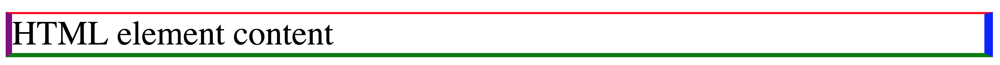
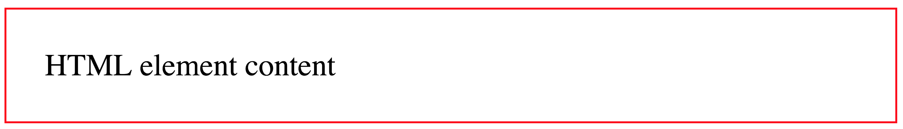

# CSS - Cascade Style Sheet

[<- Go Back](html.md)

## Intro to CSS

* **CSS** stands for **C**ascading **S**tyle **S**heets and it's a language used to describe the presentation of a document written in HTML
* CSS describes how elements should be rendered on screen, on paper, in speech, or on other media types

  **CSS code example:**
  ```CSS
  span {
    color: white;
  }
  ```

* In this example we define that all span elements will show white text
* Using this code we can see that with CSS we'll select one or many elements & set some property and value to update the way the element should look

  **CSS code example:**
  ```CSS
  element_selector {
    property_name: property_value;
  }
  ```

* By working with CSS we'll be selecting elements and defining how they should look
* We can also define if the style should be applied at the element, document or site level
* [Chrome Devtools](https://developers.google.com/web/tools/chrome-devtools) is a great tool to use when coding CSS and JavaScript
* [Read the MDN CSS reference guide](https://developer.mozilla.org/en-US/docs/Web/CSS/Reference)

## Element Type selectors
* The **type selector** matches elements by node name
* It selects **all** elements of the given type within a document
* Between **{ }** goes CSS code
* [MDN type selecto doc](https://developer.mozilla.org/en-US/docs/Web/CSS/Type_selectors)

  **Selector Example**
  ```css
  /* This selector selects all p elements */
  p {
    /* CSS Code */
  }

  /* This selector selects all div elements */
  div {
    /* CSS Code */
  }

  /* This selector selects all span elements */
  span {
    /* CSS Code */
  }
  ```

### Color
* The **color** CSS property sets the foreground color value of an element's text content and text decorations
* This property accepts any CSS color value:
  * Named color: white, red, blue, green
  * RGB (Red, Green & Blue): rgb(0,0,0)
  * Hexadecimal color: #000000, #ffffff
* [MDN color property](https://developer.mozilla.org/en-US/docs/Web/CSS/color)
* [Wikipedia RGB doc](https://en.wikipedia.org/wiki/RGB_color_model)
* [To learn more about color models](https://developer.mozilla.org/en-US/docs/Web/CSS/color_value)
* [Hexadecimal system](https://en.wikipedia.org/wiki/Hexadecimal)

  **Example:**
  ```css
    /* All p elements are blue */
    p {
      color: blue;
    }

    /* All div elements are red */
    div {
      color: rgb(255, 0, 0);
    }

    /* All span elements are green */
    span {
      color: #00FF00;
    }
  ```

  ```html
  <p>Blue text</p>
  <p>Blue &amp; <span>green</span> text</p> 
  <div>Red text</div>
  <div>Red &amp; <span>green</span> text</div>
  <span>Green text</span>
  ```

## How to apply CSS to a document
* The **style** element contains style information for a document, or part of a document
* By default, the style instructions written inside that element are expected to be CSS
* The **type** attribute is optional and defaults to **text/css** if it is missing
* [MDN style element doc](https://developer.mozilla.org/en-US/docs/Web/HTML/Element/style)

  **Example:**
  ```html
  <!DOCTYPE html>
  <html>
    <head>
      <title>Using CSS in a Document</title>
      <style type="text/css">
        /* We select all the document span elements and apply the color property with a white value */
        span {
          color: white;
        }
      </style>
    </head>
    <body>
      <span>White text</span>
      <span>White text</span>
      <span>White text</span>
    </body>
  </html>
  ```

* We can make our document different by only changing the color value

  **Example:**
  ```html
  <!DOCTYPE html>
  <html>
    <head>
      <title>Using CSS in a Document</title>
      <style type="text/css">
        /* We select all the document span elements and apply the color property with a red value */
        span {
          color: red;
        }
      </style>
    </head>
    <body>
      <span>Red text</span>
      <span>Red text</span>
      <span>Red text</span>
    </body>
  </html>
  ```

#### Practice
[Exercise 1](exercises/css/ex_1.md)

## CSS Styles

* As we know we can apply css in different ways:
  * Document
  * Inline style
  * Site

### Inline style
* We can use the **style** attribute to apply css to only one HTML element
* This attribute accepts a pair of property:value
* To apply more than one style we separate the property:value with a semicolon
  * Example: property:value; other-property: other-value
* We don't need to select the element as we are directly applying the style to it

  **Example:**
  ```html
  <span style="color: white;">White text</span>
  ```

* This is the most singular way to apply CSS to HTML.  The style will apply only to the single element.
* You would need to apply the style attribute to each element if you want more than one element with the same style

  **Example:**
  ```html
  <span style="color: white;">White text</span>
  <span style="color: white;">Other white text</span>
  ```

* This type of selection is usefull if we only need a couple of elements
* It's hard to change values if we have many items
* As it's the last property that the browser reads, it's also the [higher priority one](https://developer.mozilla.org/en-US/docs/Web/CSS/Specificity)
* Because it is the last property read, it's a good option when you need to override styles

#### Practice
[Exercise 2](exercises/css/ex_2.md)

### Site styles
* The **link** element links a HTML document with a CSS one
* The CSS rules that we define in a external CSS file are going to apply for each document that we link
* This is the best way to apply CSS to our sites if we have many documents and we want them to share the same look & feel
* The link tag has the following attributes:
  * **href:** define the document path that you want to link
  * **type:** as we are linking CSS we use the value "text/css"
  * **rel:** as we are linking CSS we use the value "stylesheet"

  **Example:** 

  filename: styles.css
  ```css
  span {
    color: white;
  }
  ```

  filename: index.html
  ```html
  <!DOCTYPE html>
  <html>
    <head>
      <title>Index</title>
      <!-- 
        We link the index.html file with the styles.css one
      -->
      <link href="styles.css" type="text/css" rel="stylesheet" />
    </head>
    <body>
      <span>white text</span>
      <span>white text</span>
      <span>white text</span>
      <span>white text</span>
      <span>white text</span>
    </body>
  </html>
  ```

  filename: contact.html
  ```html
  <!DOCTYPE html>
  <html>
    <head>
      <title>Contact</title>
      <!-- 
        If we have more than one document we can link the same style sheet
        Every rule defined on the external CSS file works here
      -->
      <link href="styles.css" type="text/css" rel="stylesheet" />
    </head>
    <body>
      <span>Other white text</span>
      <span>Other white text</span>
      <span>Other white text</span>
      <span>Other white text</span>
      <span>Other white text</span>
    </body>
  </html>
  ```

* We can change the way spans look in both documents by only changing one CSS value

  **Example:** 
  filename: styles.css
  ```css
  span {
    color: red;
  }
  ```

  filename: index.html
  ```html
  <!DOCTYPE html>
  <html>
    <head>
      <title>Index</title>
      <link href="styles.css" type="text/css" rel="stylesheet" />
    </head>
    <body>
      <span>Red Text</span>
      <span>Red Text</span>
      <span>Red Text</span>
      <span>Red Text</span>
      <span>Red Text</span>
    </body>
  </html>
  ```

  filename: contact.html
  ```html
  <!DOCTYPE html>
  <html>
    <head>
      <title>Contact</title>
      <link href="styles.css" type="text/css" rel="stylesheet" />
    </head>
    <body>
      <span>Other Red Text</span>
      <span>Other Red Text</span>
      <span>Other Red Text</span>
      <span>Other Red Text</span>
      <span>Other Red Text</span>
    </body>
  </html>
  ```

#### Practice
[Exercise 3](exercises/css/ex_3.md)

## CSS Selectors
* To use CSS on our site we need more ways to select elements and apply styles
* By using different types of selector we can select one or many elements at the same time
* For example: 
  * The element selector (tag name) applies the style to all the elements with the same tag name
  * The id selector applies the style to only the element that has the id attribute
* [Read the MDN selectors guide](https://developer.mozilla.org/en-US/docs/Learn/CSS/Introduction_to_CSS/Selectors)

## ID Selector
* To select elements by id we use the **#** character and the element id value
* [MDN ID selectors doc](https://developer.mozilla.org/en-US/docs/Web/CSS/ID_selectors)

  **Example:** 
  ```css
  /* Element with id="main" */
  #main {
    color: red;
  }

  div {
    color: blue;
  }
  ```

  ```html
  <div id="main">Red Main Div</div>
  <div>Blue div</div>
  <div>Blue div</div>
  ```

## Class Selector
* Also we can select all elements with same class name by using a **.** and the element class name
* [MDN Class selectors doc](https://developer.mozilla.org/en-US/docs/Web/CSS/Class_selectors)

  **Example:** 
  ```css
  /* All elements that have class="red" */
  .red {
    color: red;
  }

  div {
    color: blue;
  }
  ```

  ```html
  <div class="red">Red Main Div</div>
  <div>Blue div</div>
  <div class="red">Red Main Div</div>
  ```

* Both **id** and **class** selector can be even more specific by adding the element type before the id or class selector

  **Example:**
  ```css
  /* Only select the div with main id */
  div#main { color: red; }

  /* Only select the paragraph with blue class */
  p.blue { color: blue; }
  ```
  ```html
  <div id="main">Red Text</div>
  <p class="blue">Blue Text</p>
  <p> Text</p>
  <div class="blue">Text</div>
  ```

## Shared CSS code between selectors
* In some cases we need to use the same style for more than one element and we can choose:
  * Create a class and apply it to both elements
  * Or we can add more selectors separated by a comma

  **Example:**
  ```css
  .red{ color: red; }
  ```
  ```html
  <div class="red">Red Text</div>
  <p class="red">Red Text</p>
  ```

* Or

  **Example:**
  ```css
  selector1, selector2 {
    /* CSS code */
  }
  ```

  **Example:**
  ```css
  div, p { color: red; }
  ```
  ```html
  <div>Red Text</div>
  <p>Red Text</p>
  ```
  ## Universal selector
* The `*` universal selector matches elements of any type
* You can use this selector to delete the browser initial styles (Many CSS libraries do it)
* [MDN Universal selectors doc](https://developer.mozilla.org/en-US/docs/Web/CSS/Universal_selectors)

  **Example:**
  ```css
  /* The universal selector will match all the elements and sets the color to white */
  * {
    color: white;
  }
  ```
  ```html
  <div>White div text</div>
  <p>White paragraph text</p>
  <span>White span text</span>
  <a href="#">White link text</a>
  ```

## Attribute selectors
* Selects elements based on the value of the given attribute
* First we select the element
* Then we add brackets
* Between brackets we add the attribute = value
* [MDN Attribute selectors doc](https://developer.mozilla.org/en-US/docs/Web/CSS/Attribute_selectors)

  **Example:**
  ```css
  /* Select all a elements that have a href="#" attribute */
  a[href="#"] { color: pink; }

  /* Select all div elements that have the name main attribute */
  div[name="main"] { color: yellow; }
  ```
  ```html
  <div name="main">Yellow div text</div>
  <a href="#">Pink link text</a>
  <a href="http://www.google.com"></a>
  ```

#### Practice
[Exercise 4](exercises/css/ex_4.md)

## Pseudo-classes selector
* The pseudo-class is a keyword added to a selector that specifies a special state of the selected element(s)
* For example, :hover can be used to change a button's color when the user hovers over it
* For links we can use the following pseudo-classes: **:link, :active, :hover & :visited**
* See a complete Pseudo-classes list on [MDN Pseudo-classes doc](https://developer.mozilla.org/en-US/docs/Web/CSS/Pseudo-classes)

  **Example:**
  ```css
  a:link {
    color: red;
  }

  a:active {
    color: pink;
  }

  a:hover {
    color: gray;
  }

  a:visited {
    color: green;
  }
  ```

## Descendant selectors
* This selector is represented by a single space ( ) character & combines two selectors such that elements matched by the second selector are selected if they have an ancestor element matching the first selector
* It will apply to any element inside other element without being a direct dependency
* [MDN Descendant selectors doc]()https://developer.mozilla.org/en-US/docs/Web/CSS/Descendant_selectors

  **Example:**
  ```css
  div a {
    color: red;
  }
  ```
  ```html
  <div>
    <a href="#">Link inside a div</a>
    <p>
      <a href="#">Link inside a parragraph inside a div</a>
    </p>
  </div>
  ```

## Child selectors
* Using the **>** selector we can select only those elements matched by the second selector that are the direct children of elements matched by the first
* The child combinator **>** is placed between two CSS selectors. 
* Elements matched by the second selector must be the immediate children of the elements matched by the first selector
* This is stricter than the descendant selector
* [Child selectors](https://developer.mozilla.org/en-US/docs/Web/CSS/Child_selectors)

  **Example:**
  ```css
  /* Select the paragraph elements that are direct children from a div element*/
  div > p {
    color: red;
  }
  ```
  ```html
  <p>Black text</p>
  <div>
    <p>Red Text</p>
    <table>
      <tr>
        <td><p>Black Text</p></td>
      </tr>  
    </table>
    <h1>Black text</h1>
  </div>
  ```

* In this example we can see that this selector only affects the div child paragraph

## Pseudo-elements
* A CSS **pseudo-element** is a keyword added to a selector that lets you style a specific part of the selected element(s)
* We use the **::** operator to select **pseudo-element**
* These are the most used **pseudo-element**:
  * ::first-line
  * ::first-letter
  * ::selection
  * ::after
  * ::before
* The pseudo-elements ::after & ::before need to use a special property called **content**
* [MDN Pseudo elements docs](https://developer.mozilla.org/en-US/docs/Web/CSS/Pseudo-elements)

  **Example:**
  ```css
  div::first-line {
    color: red;
  }

  p::first-letter {
    color: blue;
  }

  span::before {
    content: '1';
  }

  span::after {
    content: '2';
  }
  ```

## Adjacent sibling combinator
* The **+** separates two selectors and matches the second element only if it immediately follows the first element, and both are children of the same parent element

**Example:**
```css
p + div {
  color: red;
}
```
```html
<p>Parragraph content</p>
<div>Red text sibling Div</div>
<div>Black sibling Div</div>
```

## General sibling combinator
* The **~** separates two selectors and matches the second element only if it follows the first element (though not necessarily immediately), and both are children of the same parent element

  **Example:**
  ```css
  p ~ div {
    color: red;
  }
  ```
  ```html
  <p>Parragraph content</p>
  <div>Red text sibling Div</div>
  <div>Red text sibling Div</div>
  ```

#### Practice
[Exercise 5](exercises/css/ex_5.md)

## Font
* To make our site look better we can select the font that we want to use
* HTML elements can have text content and we can change the way it looks
* We already saw how to change the color and now it's the time to change other font properties

* [MDN Styling text Fundamentals](https://developer.mozilla.org/en-US/docs/Learn/CSS/Styling_text/Fundamentals)
* [MDN Web Fonts Guide](https://developer.mozilla.org/en-US/docs/Learn/CSS/Styling_text/Web_fonts)

### Family
* The **font-family** property specifies a prioritized list of one or more font family names and/or generic family names for the selected element
* Values are separated by commas to indicate that they are alternatives
* We need to add double quotes if the font-family name has spaces in it. Example: "times new roman"
* The browser will select the first font in the list that is installed
* If the browser can't use the first font value it will try to use the next one in the list
* It's a good practice to add a generic font family just in case none of the other values works for a particular browser
* By adding a default value we make sure that at least our site has a font-family style
* Generic family name list: **serif, sans-serif, monospace, cursive, fantasy, system-ui**
* [MDN font-family doc](https://developer.mozilla.org/en-US/docs/Web/CSS/font-family)

  

  **Example:**
  ```css
  body { font-family: serif; }
  ```

  or

  ```css
  body {
    font-family: "Times New Roman", Times, serif;
  }
  ```

  or

  ```css
  body {
    font-family: Arial, Helvetica, sans-serif;
  }
  ```

* In this case the browser will try to use the first value (Times new roman or arial depending the case)
* We can add a different font family that might be similar to the previous one just in case the first one doesn't work
* Finaly we add a third option with a generic font-family to make the text look the way we want in some way

### Web Fonts
* Web fonts are a CSS feature that allows you to specify font files to be downloaded along with your website as it is accessed
* Any browser that supports web fonts can have exactly the fonts you specify available to it
* The @font-face CSS rule allows authors to specify fonts (online url(), and locally local()), to display text on their web pages 
* By allowing authors to provide their own fonts, @font-face eliminates the need to depend on the limited number of fonts users have installed on their computers
* Don't forget that not all fonts are free! 
* To use custom fonts first we need to define it
[MDN font-face doc](https://developer.mozilla.org/en-US/docs/Web/CSS/@font-face)

  **Example:**
  ```css
  /* We define the font Bitstream Vera Serif Bold from a external source */
  @font-face {
    font-family: "Bitstream Vera Serif Bold";
    src: url("https://mdn.mozillademos.org/files/2468/VeraSeBd.ttf");
  }

  /* In this case we define a local (our server) font */
  @font-face {
    font-family: MyHelvetica;
    src: local("Helvetica Neue Bold"),
        local("HelveticaNeue-Bold"),
        url(MgOpenModernaBold.ttf);
    font-weight: bold;
  }
  ```

* For local fonts we need to use the **src** property
* We can use it by name or url (path to the file)

  **Example:**
  ```css
  body {
    font-family: "Bitstream Vera Serif Bold";
  }

  span {
    font-family: "Helvetica Neue Bold";
  }
  ```

* Also we can use [Google fonts](https://fonts.google.com) in our documents
* First we need to select a font using the + icon
* Then we'll see a dialog on the bottom righ section of the site
* We'll have to use the **link HTML element** to add a reference to the google font site

  **Example:**
  ```html
  <link href="https://fonts.googleapis.com/css?family=IBM+Plex+Mono" rel="stylesheet">
  ```

* After adding the reference we can call using the font name

  **Example:**
  ```css
  body { font-family: 'IBM Plex Mono', monospace; }
  ```

* Google fonts does a great work to help us adding our fonts

  

* To know more about Google Fonts read the following [guide](https://developers.google.com/fonts/docs/getting_started)

### Size
* The **font-size** property specifies the size of the font
* Setting this property may change the size of other items, too, since it is used to compute the value of em, ex, and various other relative length units
* Absolute value:
  * Pixed (px)
  * Point (pt): One point. 1pt = 1/72nd of 1in (used to print)
* Relative values:
  * percentage (%:
  * (em): Represents the calculated font-size of the element. If font is 10px and 1em, then 2em is 20px
  * Viewport Height (vh): Equal to 1% of the height of the viewport's initial containing block.
  * Viewport Width (vw): Equal to 1% of the width of the viewport's initial containing block.
* [MDN font-size doc](https://developer.mozilla.org/en-US/docs/Web/CSS/font-size)
* [MDN length doc](https://developer.mozilla.org/en-US/docs/Web/CSS/length)
* [MDN percentage Doc](https://developer.mozilla.org/en-US/docs/Web/CSS/percentage)
* [Viewport sized yypography tutorial](https://css-tricks.com/viewport-sized-typography/)
* [Read the How to size text in css a list apart guide!](https://alistapart.com/article/howtosizetextincss)

  

  **Example:**
  ```css
  /* We set the body font size in 16px using a absolute value */
  body { font-size: 16px; }

  /* Now the font-size is 16px so we can use a relative value like 2em to change it (32px) */
  h1 { font-size: 2em; }
  ```

* In the previous example if we change the body font-size it will change how every element with a relative value looks 

### Weight
* The font-weight property specifies the weight (or boldness) of the font
* The font weights available to you will depend on the font-family you are using
* Some fonts are only available in normal and bold
* Font weight values:
  * normal: same as 400
  * bold: same as 700
  * lighter: one font weight lighter than the parent element (among the available weights of the font)
  * bolder: one font weight heavier than the parent element (among the available weights of the font)
  * Number bettwen 100 & 900: numeric font weights for fonts that provide more than just normal and bold
* [MDN font-weight doc](https://developer.mozilla.org/en-US/docs/Web/CSS/font-weight)
* [CSS tricks font-weight tutorial](https://css-tricks.com/almanac/properties/f/font-weight)

  **Example:**
  ```css
  body {
    font-weight: normal;
  }

  .bold {
    font-weight: bold;
  }

  .bolder {
    font-weight: bolder;
  }

  div {
    font-weight: 600;
  }
  ```
  ```html
  <body>
    <p>This span is <span class="bold">bold</span></p>
    <div>
      <p>This paragraph uses 600 font-weight and this <span class="bolder">span use 700</span></p>
    </div>
  </body>
  ```

### Style
* The **font-style** CSS property specifies whether a font should be styled with a normal, italic, or oblique face from its font-family
* [MDN font-style doc](https://developer.mozilla.org/en-US/docs/Web/CSS/font-style)
* [Stackoverflow font-style italic vs oblique](https://stackoverflow.com/questions/1680624/font-style-italic-vs-oblique-in-css)

  **Example:**
  ```css
  .quote { font-style: oblique; }

  div { font-style: italic; }
  ```

### Transform
* The **text-transform** property specifies how to capitalize an element's text
* This prorperty is text and not font as it's changing the text style and doesn't have to do with font
* It can be used to make text appear in all-uppercase or all-lowercase, or with each word capitalized
* [MDN text-transform doc](https://developer.mozilla.org/en-US/docs/Web/CSS/text-transform)

  **Example:**
  ```css
  div {
    text-transform: capitalize;
  }

  p {
    text-transform: lowercase;
  }

  span {
    text-transform: uppercase;
  }
  ```

### Align
* The **text-align** property describes how inline content like text is aligned in its parent block element
* This property align does not control the alignment of block elements, only their inline content (just the text)
* We can use the following values: **inherit, left, right, center, justify, justify-all, start, end, match-parent**
  * justify-all: works in the same way tha justify, but also forces the last line to be justified
  * start: same as left if direction is left-to-right and right if direction is right-to-left
  * end: same as right if direction is left-to-right and left if direction is right-to-left
  * match-parent: similar to inherit, but the values start and end are calculated according to the parent's direction and are replaced by the appropriate left or right value
* [MDN text-align doc](https://developer.mozilla.org/en-US/docs/Web/CSS/text-align)

  **Example:**
  ```css
  body { text-align: left; }

  .right { text-align: right; }
  .justify { text-align: justify; }
  ```

  ```html
  <body>
    <p>Normal text in a paragraph</p>
    <div class="right">This text it's aligned to the right</div>
    <div class="justify">If we add a long text it's going to be justified</div>
  </body>
  ```

### Decoration

#### Line
* The **text-decoration-line**  property sets the kind of decoration that is used on text in an element
* Property values: none, underline, overline, line-through, blink
* We can add more than one value to this property
* [MDN text-decoration-line doc](https://developer.mozilla.org/en-US/docs/Web/CSS/text-decoration-line)

  **Example:**
  ```css
  div {
    text-decoration-line: overline;
  }

  p {
    text-decoration-line: line-through overline ;
  }
  ```

#### Color
* The **text-decoration-color** property sets the color of the decorative additions to text that are specified by text-decoration-line
* We can use it with underlines and overlines, strikethroughs, and wavy lines
* The specified color applies to all such decorative lines in the scope of the property's value
* [MDN text-decoration-color doc](https://developer.mozilla.org/en-US/docs/Web/CSS/text-decoration-color)

  **Example:**
  ```css
  div {
    text-decoration-line: overline;
    text-decoration-color: red;
  }
  ```

#### Style
* The **text-decoration-style** property sets the style of the lines specified by **text-decoration-line**
* The style applies to all lines that are specified; there is no way to define different styles for each of the lines defined by text-decoration-line
* Property values: **solid, double, dotted, dashed, wavy**
* [MDN text-decoration-style doc](https://developer.mozilla.org/en-US/docs/Web/CSS/text-decoration-style)

**Example:**
```css
div {
  text-decoration-line: overline;
  text-decoration-color: red;
  text-decoration-style: dashed;
}
```

#### Single definition

* The **text-decoration** property specifies the appearance of decorative lines used on text
* It's a shorthand for setting one or more individual text-decoration values in a single declaration
* Format syntax: text-decoration-style text-decoration-line text-decoration-color
* [MDN text-decoration doc](https://developer.mozilla.org/en-US/docs/Web/CSS/text-decoration)

  **Example:**
  ```css
  div {
    text-decoration: dashed underline red;
  }

  /* same as: */
  div {
    text-decoration-style: dashed;
    text-decoration-line: underline;
    text-decoration-color: red;
  }
  ```

### Indent
* The **text-indent** property specifies the amount of indentation (empty space) that is put before lines of text in a block
* [MDN text-indent doc](https://developer.mozilla.org/en-US/docs/Web/CSS/text-indent)

  **Example:**
  ```css
  div {
    text-indent: 10px;
  }

  p {
    text-indent: 15%;
  }
  ```

### Shadow
* The **text-shadow** property adds shadows to text
* It accepts a comma-separated list of shadows to be applied to the text and any of its decorations
* Each shadow is described by some combination of **X and Y offsets from the element, blur radius, and color**
* Shadow values:
  * The first two `length` values are the **offset-x** and **offset-y** values
  * The third, optional, `length` value is the **blur-radius**
  * The `color` value is the **shadow's color**
* [MDN text-shadow doc](https://developer.mozilla.org/en-US/docs/Web/CSS/text-shadow)
* [CSS3 text-shadow generator](http://www.cssportal.com/css3-text-shadow-generator)
* [CSS Tricks - CSS text-shadow](https://css-tricks.com/snippets/css/css-text-shadow)

  **Example:**
  ```css
  div{
    /* offset-x | offset-y | blur-radius | color */
    text-shadow: 5px 5px 1px black; 
  }
  ```

### Letter Spacing
* The **letter-spacing**  property specifies the spacing behavior between text characters
* [MDN letter-spacing doc](https://developer.mozilla.org/en-US/docs/Web/CSS/letter-spacing)

  **Example:**
  ```css
  p {
    letter-spacing: 3px;
  }
  ```

* The **word-spacing** property specifies the spacing behavior between tags and words
* [MDN word-spacing doc](https://developer.mozilla.org/en-US/docs/Web/CSS/word-spacing)

  **Example:**
  ```css
  div {
    word-spacing: 2px;
  }
  ```

### Line height
* The **line-height** property sets the amount of space used for lines, such as in text
* On block-level elements, it specifies the minimum height of line boxes within the element
* On non-replaced inline elements, it specifies the height that is used to calculate line box height
* Property values:
  * normal: depends on the user agent. Desktop browsers (including Firefox) use a default value of roughly 1.2, depending on the element's font-family
  * number: the used value is this unitless number multiplied by the element's own font size. 
    * The computed value is the same as the specified number
    * In most cases, this is the preferred way to set line-height and avoid unexpected results due to inheritance
    * length: is used in the calculation of the line box height
      * Values given in em units may produce unexpected results
    * percentage: relative to the font size of the element itself
      * The computed value is this **percentage** multiplied by the element's computed font size
      * Percentage values may produce unexpected results
* [MDN line-height doc](https://developer.mozilla.org/en-US/docs/Web/CSS/line-height)
* [CSS Tricks - line-height](https://css-tricks.com/almanac/properties/l/line-height)

  **Example:**
  ```css
  /* 10 * 1.2 => 12 */
  div { 
    font-size: 10pt;
    line-height: 1.2;
  }
  ```

#### Practice
[Exercise 6](exercises/css/ex_6.md)

### Vertical Align
* The **vertical-align** property specifies the vertical alignment of an inline or table-cell box
* This property only applies to inline and table-cell elements (you can't use it to vertically align block-level elements)
* Property values: **baseline, sub, super, text-top, text-bottom, middle, top, bottom**
* [MDN vertical-align doc](https://developer.mozilla.org/en-US/docs/Web/CSS/vertical-align)
* [CSS Tricks - vertical-align](https://css-tricks.com/almanac/properties/v/vertical-align)
* [CSS Tricks - What is vertical align?](https://css-tricks.com/what-is-vertical-align)

  **Example:**
  ```css
  img {
    vertical-align: text-top;
  }
  ```

#### Practice
[Exercise 7](exercises/css/ex_7.md)

## Box Model

* We can think about HTML elements as a box
* This concept is known as CSS box model
* The CSS box model is the foundation of layout on the Web as each element is represented as a rectangular box

  

* The box model has 5 parts:
  * **Content area**
  * **Padding area:** refers to the inner margin of a CSS box — between the outer edge of the content box and the inner edge of the border
  * **Border area:** it sits between the outer edge of the padding and the inner edge of the margin
  * **Margin area:** it surrounds a CSS box, and pushes up against other CSS boxes in the layout
  * **Width & height:** this properties set the width and height of the content box, which is the area in which the content of the box is displayed
* [MDN Introduction to the CSS box model](https://developer.mozilla.org/en-US/docs/Web/CSS/CSS_Box_Model/Introduction_to_the_CSS_box_model)
* [MDN Box model](https://developer.mozilla.org/en-US/docs/Learn/CSS/Introduction_to_CSS/Box_model)
* [CSS Tricks - the-css-box-model](https://css-tricks.com/the-css-box-model)

* This properties are added to define the element real width and height value
* **Width** =	width + padding-left + padding-right + border-left + border-right
* **Height** = height + padding-top + padding-bottom + border-top + border-bottom

* Older browsers used to calculate the box model in a different way and this was one of the biggest issues developers had creating layouts
  * [Wikipedia - Internet Explorer box model bug](https://en.wikipedia.org/wiki/Internet_Explorer_box_model_bug)

### Border:
* The **border** property is a shorthand for setting all individual border property values in a single declaration
  * border-width
  * border-style
  * border-color
* [MDN border doc](https://developer.mozilla.org/en-US/docs/Web/CSS/border)

  **Example:**
  ```css
  div {
    border: 1px solid red;
  }
  ```

  

* We can also use individual property for each of the values:
  * border-width
  * border-style
  * border-color 

  **Example:**
  ```css
  div {
    border-width: 1px;
    border-style: solid;
    border-color: red;
  }
  ```

* Using the **border** property we set the same width, style and color for all 4 element borders
* We can set individual borders for each border using the border name: left, top, right, bottom

  **Example:**
  ```css
  div {
    border-top: 1px solid red;
    border-bottom: 2px solid green;
    border-left: 3px solid purple;
    border-right: 4px solid blue;
  }
  ```

  

### Width
* The **border-width** property is a shorthand property for setting the widths on all four sides of an element's border
* When `one value` is specified, it applies the same width to `all four sides`
* When `two values` are specified, the first width applies to the `top and bottom`, the second to the `left and right`
* When `three values` are specified, the first width applies to the `top`, the second to the `left and right`, the third to the `bottom`
* When `four values` are specified, the widths apply to the `top, right, bottom, and left` in that order **(clockwise)**
* Many CSS properties works this way
* We can also set keyword values using: **thin, medium & thick**
* [MDN border-width doc](https://developer.mozilla.org/en-US/docs/Web/CSS/border-width)

  **Example:**
  ```css
  /* All borders width are set to 2px */
  div {
    border-width: 2px;
  }

  /* Top, Bottom are set to 2px and left, right to 3px */
  p {
    border-width: 2px 3px;
  }

  /* Top is set to 2px, left &  right to 3px and finaly bottom is set to 1px */
  span {
    border-width: 2px 3px 1px;
  }

  /* top: 2px, right: 3px, bottom: 4px and left: 5px */
  a {
    border-width: 2px 3px 4px 5px;
  }
  ```

### Style
* The **border-style** property is a shorthand property that sets the line style for all four sides of an element's border
* We can set from one to four individual values like we do with the border-width property
* Property values: **none, hidden, dotted, dashed, solid, double, groove, ridge, inset, outset**
* [MDN border-style doc](https://developer.mozilla.org/en-US/docs/Web/CSS/border-style)

  **Example:**
  ```css
  /* All borders set to dotted */
  div {
    border-width: dotted;
  }
  ```

### Color
* The **border-color** property is a shorthand property for setting the colors on all four sides of an element's border

* [MDN border-color doc](https://developer.mozilla.org/en-US/docs/Web/CSS/border-color)

  **Example:**
  ```css
  div {
    border-color: blue;
  }
  ```

* Each of this property can use the border name to set the property value to each individual border:

  **Example:**
  ```css
  /* We can use the border properties shortcuts or use individual values for each property and border type */
  div {
    border: 1px solid red;

    border-top: 1px solid red;
    border-bottom: 1px solid red;
    border-left: 1px solid red;
    border-right: 1px solid red;

    border-top-width: 1px;
    border-bottom-width: 1px;
    border-left-width: 1px;
    border-right-width: 1px;

    border-top-style: solid;
    border-bottom-style: solid;
    border-left-style: solid;
    border-right-style: solid;

    border-top-color: red;
    border-bottom-color: red;
    border-left-color: red;
    border-right-color: red;
  }
  ```

### Border Radius
* The **border-radius** property lets you round the corners of an element's outer border edge
* You can specify a single radius to make circular corners, or two radii to make elliptical corners
* Property values: one, two, three, or four length or percentage values
* [MDN border-radius doc](https://developer.mozilla.org/en-US/docs/Web/CSS/border-radius)
* [Border radius generator](http://border-radius.com)

  **Example:**
  ```css
  div {
    /* Radius is set for all 4 sides */
    border-radius: 10px;
  }

  p {
    /* top-left-and-bottom-right | top-right-and-bottom-left */
    border-radius: 10px 5%;
  }

  section {
    /* top-left | top-right-and-bottom-left | bottom-right */
    border-radius: 2px 4px 2px;
  }

  a {
    /* top-left | top-right | bottom-right | bottom-left */
    border-radius: 1px 0 3px 4px;
  }

  ```

* This property is a shorthand to set the four properties: 
  * border-top-left-radius
  * border-top-right-radius
  * border-bottom-right-radius
  * border-bottom-left-radius

  **Example:**
  ```css
  div {
    border-top-left-radius: 10px;
    border-top-right-radius: 10px;
    border-bottom-right-radius: 10px;
    border-bottom-left-radius: 10px;
  }
  ```

* Now we can set the border width, style, color & radius

  **Example:**
  ```css
  div {
    border: 1px solid red;
    border-radius: 40px 50px;
  }
  ```

#### Practice
[Exercise 8](exercises/css/ex_8.md)

### Padding
* The padding property defines the innermost portion of the box model, creating space around an element's content, inside of any defined margins and/or borders
* When one value is specified, it applies the same padding to all four sides
* When two values are specified, the first padding applies to the top and bottom, the second to the left and right
* When three values are specified, the first padding applies to the top, the second to the left and right, the third to the bottom
* When four values are specified, the paddings apply to the top, right, bottom, and left in that order (clockwise)
* [MDN padding doc](https://developer.mozilla.org/en-US/docs/Web/CSS/padding)
* [CSS Tricks doc](https://css-tricks.com/almanac/properties/p/padding/)

  **Example:**
  ```css
  div {
    border: 1px solid red;
    padding: 20px;
  }
  ```

  

* It is a shorthand for setting all individual paddings at once: 
  * padding-top
  * padding-right
  * padding-bottom
  * padding-left

  **Example:**
  ```css
  div {
    border: 1px solid red;
    padding-top: 20px;
    padding-right: 20px;
    padding-bottom: 20px;
    padding-left: 20px;
  }
  ```

* We can also use the padding property to set values for each individual side:

  **Example:**
  ```css
  div {
    border: 1px solid red;

    /* top, bottom: 10px and left, right: 20px*/
    padding: 10px 20px;
    
    /* top: 10px, left, right: 20px and bottom: 30px */
    padding: 10px 20px 30px;
    
    /* top: 10px, right: 20px, bottom: 30px and left: 40px */
    padding: 10px 20px 30px 40px;
  }
  ```

### Margin
* The margin property defines the outermost portion of the box model, creating space around an element, outside of any defined borders
* Property values: same as padding
* [MDN margin doc](https://developer.mozilla.org/en-US/docs/Web/CSS/margin)

  **Example:**
  ```css
  body {
    padding: 0;
    margin: 0;
    border: 2px solid purple;
  }

  div {
    border: 1px solid red;
    margin: 0px;
  }
  ```

  

  **Example:**
  ```css
  div {
    border: 1px solid red;
    margin: 10px;
  }
  ```

  

* It is a shorthand for setting all individual margins at once: 
  * margin-top
  * margin-right
  * margin-bottom
  * margin-left


  **Example:**
  ```css
  div {
    border: 1px solid red;
    margin-top: 10px;
    margin-right: 10px;
    margin-bottom: 10px;
    margin-left: 10px;
  }
  ```

### Width & Height
* The **width** property specifies the width of an element
  * By default, the property defines the width of the content area
* The **height** property specifies the height of an element
  * By default, the property defines the height of the content area
* [MDN width doc](https://developer.mozilla.org/en-US/docs/Web/CSS/width)
* [MDN height doc](https://developer.mozilla.org/en-US/docs/Web/CSS/height)

  **Example:**
  ```css
  div {
    width: 200px;
    height: 200px;
  }
  ```

* The **min-width** property sets the minimum width of an element
  * It prevents the used value of the width property from becoming smaller than the value specified for min-width
* The **min-height** property sets the minimum height of an element
  * It prevents the used value of the height property from becoming smaller than the value specified for min-height.
* [MDN min-width doc](https://developer.mozilla.org/en-US/docs/Web/CSS/min-width)
* [MDN min-height doc](https://developer.mozilla.org/en-US/docs/Web/CSS/min-height)

  **Example:**
  ```css
  div {
    min-height: 100px;
    min-width: 100px;
  }
  ```

* The max-width CSS property sets the maximum width of an element
  * It prevents the used value of the width property from becoming larger than the value specified by max-width
* The max-height CSS property sets the maximum height of an element
  * It prevents the used value of the height property from becoming larger than the value specified for max-height
* [MDN max-width doc](https://developer.mozilla.org/en-US/docs/Web/CSS/max-width)
* [MDN max-height doc](https://developer.mozilla.org/en-US/docs/Web/CSS/max-height)

  **Example:**
  ```css
  div {
    max-height: 300px;
    max-width: 300px;
  }
  ```

### Center element using auto margin
* We can set the margin value to **auto**
* By setting left and right margins to auto we can center align a element
* Also we need to use the width property
* We can only center elements horizontaly using this technic 
* Use margin auto with `block` elements only
* To center an inline element we can always use **text-align:center**

  **Example:**
  ```css
  div {
    width: 500px;
    /* We set the top, bottom margin to 0 and left, right to be auto */
    margin: 0 auto;
  }
  ```

#### Practice
[Exercise 9](exercises/css/ex_9.md)

  
