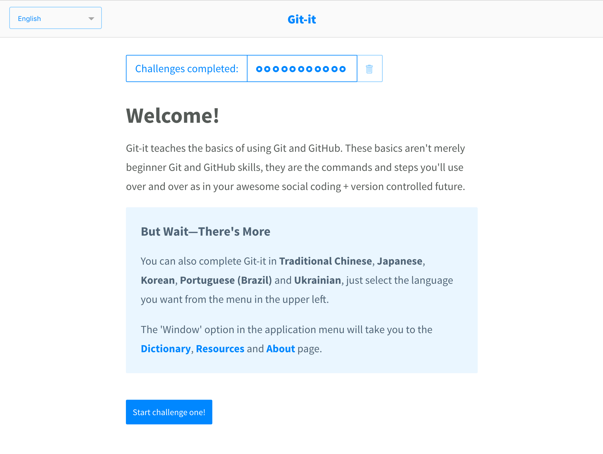

# Git & Github

[<- Go Back](first-site.md)


## Git

> Git is a free and open source **distributed version control system** designed to handle everything from small to very large projects with speed and efficiency.

* [Download and install Git](https://git-scm.com)
* After install run the following command on your terminal. This should tell us the version of Git (Current version is `2.21.0`). 
    ```bash
    git --version
    ```
* [Configure Git name and email](https://help.github.com/articles/setting-your-commit-email-address-in-git/)
    ```bash
    git config --global user.name <github userID>
    git config --global user.email <github email>
    ```
* To configure our Git/Github project we'll need to use our [command line interface](https://en.wikipedia.org/wiki/Command-line_interface)
* As the commands might change between operating systems:
  * [Windows Command Prompt Cheat sheet](http://simplyadvanced.net/blog/cheat-sheet-for-windows-command-prompt)
  * [Linux/Mac Bash Cheat sheet](https://learncodethehardway.org/unix/bash_cheat_sheet.pdf)
* This tutorial uses the Linux/Mac commands (If you use Windows please check the previous guide)
* You’ve downloaded Git, now what? [Download Git-It](https://github.com/jlord/git-it-electron#what-to-install) to your machine and you’ll get a hands-on tutorial that teaches you to use Git right from your local environment, using commands on real repositories. 

## Using Git
* To configure our Git/Github project we'll need to use our [command line interface](https://en.wikipedia.org/wiki/Command-line_interface)

* This tutorial uses the Linux/Mac commands (If you use Windows please check the previous guide)
* Create a folder with the name `nodeyqr`
	```bash
	mkdir nodeyqr
	```
* Change directory to `nodeyqr`
	```bash
	cd nodeyqr
	```
* Make sure you're on the right folder (`nodeyqr`)
	```bash
	pwd
	```
* You must see your path and **/nodeyqr**
* At this point we have everything we need to start versioning our `nodeyqr` folder / project

### `git status`
* **git status** show the working tree status
* [Git status doc](https://git-scm.com/docs/git-status)
* Run the following command:
	```bash
	git status
	```
* You should see the following legend: fatal: `Not a git repository (or any of the parent directories): .git`
* We get this error message as we didn't told Git to start watching this project

### `git init`
* This command create an empty Git repository or reinitialize an existing one
* To configure Git in this folder well run `git init`
* [Git init doc](https://git-scm.com/docs/git-init)
	```bash
	git init
	```
* You should get the following message: `Initialized empty Git repository in your folder path`
* Now Git knows that we want to version this project and keep track of all the changes we do
* Let check git status again
	```bash
	git status

	> On branch master
	> No commits yet
	> nothing to commit (create/copy files and use "git add" to track)
	```
* After running **git init** we don't longer see an error
* Now we find out that we'll be using **branches**, **commits** & **add**ing files
* Open the folder `nodeyqr` using VSC (Visual Studio Code)
* Git creates a hidden folder to keep track of our project
* List your folder files to see the `.git` folder
	```bash
	ls -la

	> .
	> ..
	> .git
	```
* Create a new file and save it with the name **index.html**
* Add the following content:
	```html
	<!DOCTYPE html>
	<html lang="en">
		<head>
			<title>Using Git</title>
		</head>
		<body>
			<h1>Using Git</h1>
			<p>Creating my first versioned file</p>
		</body>
	</html>
	```
* Make sure to save the file again
* Go to the terminal and check Git status
	```bash
	git status

	> On branch master
	> No commits yet
	> Untracked files:
		(use "git add <file>..." to include in what will be committed)

		index.html

	> nothing added to commit but untracked files present (use "git add" to track)
	```
* So we still get the same messages:
	```
	> On branch master
	> No commits yet
	```
* But now we can see that we added a new file to the folder and Git knows about it
* As we haven't done anything with this file it have an `Untracked` state
* Also Git gives us some help: `use "git add <file>..." to include in what will be committed`

### `git add`
* This command add file/s contents to Git index
* Lets add the index.html to Git index
	```bash
	git add index.html
	```
* Looks like nothing happened
* Check git status again
	```bash
	git status

	> On branch master
	> No commits yet
	> Changes to be committed:
		(use "git rm --cached <file>..." to unstage)

	> 	new file:   index.html
	```
* By executing **git add** we add the documents that we want to **commit**

### `git commit`
* This command records changes to the repository
* When we commit one or many files we create a new version of our project
* To know what changed over time it's a good practice to write a descriptive message
* Now we can commit our changes running **git commit -m 'Commit message'**
	```bash
	git commit -m 'Added index.html file to project'

	> [master (root-commit) 50400f2] Added index.html file to project
	> 1 file changed, 10 insertions(+)
	> create mode 100644 index.html
	```
* We can see that only 1 file has changed and we added 10 new lines of code
* Run git status to check the new status
	```bash
	git status

	> On branch master
	> nothing to commit, working tree clean
	```
* As we just committed our changes there's nothing new to commit

### `git log`
* This command shows commit logs
* We can check our project commit history by running **git log**
	```bash
	git log

	> commit 50400f2fd1b7f6ce7030a2e651ac6c2956d53c58 (HEAD -> master)
	> Author: Nicolas Isnardi <nicolasisnardi@gmail.com>
	> Date:   Sun Mar 11 21:39:21 2018 -0500

	>    Added index.html file to project
	```
* Once we run this command we can see all the commits that this project has
* By writing good commit messages we can know more about what changed over time
* Open the index.html file again and change the following lines:
	```html
	<h1>Using Git</h1>
	<p>Creating my first versioned file</p>
	```
	To
	```html
	<h1>Learning and using Git</h1>
	<p>Creating my commits</p>
	```
* Save your file
* Check Git status
	```bash
	git status

	> On branch master
	> Changes not staged for commit:
		(use "git add <file>..." to update what will be committed)
		(use "git checkout -- <file>..." to discard changes in working directory)

		modified:   index.html

	> no changes added to commit (use "git add" and/or "git commit -a")
	```
* Now we can see a couple of new things going on:
  * Git shows 2 options:
    * We can add the changes we did to index.html to commit them: `(use "git add <file>..." to update what will be committed)`
    * Also we can checkout the previous index.html version and discard the changes we did: `(use "git checkout -- <file>..." to discard changes in working directory)`
  * Also now index.html is modified (`modified:   index.html`) instead than a new file
* Go ahead and add this changes
* Commit the changes and create a new version
* The commit message should be: Updated index.html content
* Check git log
	```bash
	git add index.html
	git status
	git commit -m 'Updated index.html content'
	git log

	> commit 418b85f87a0804a629719a03d67c264c9d64be52 (HEAD -> master)
	> Author: Nicolas Isnardi <nicolasisnardi@gmail.com>
	> Date:   Sun Mar 11 22:03:32 2018 -0500

			Updated index.html content

	> commit 50400f2fd1b7f6ce7030a2e651ac6c2956d53c58
	> Author: Nicolas Isnardi <nicolasisnardi@gmail.com>
	> Date:   Sun Mar 11 21:39:21 2018 -0500

			Added index.html file to project
	```
* Now we have 2 commits in our project log
* Delete index.html
	```bash
	rm index.html
	```
* Check Git status
	```bash
	git status

	> On branch master
	> Changes not staged for commit:
		(use "git add/rm <file>..." to update what will be committed)
		(use "git checkout -- <file>..." to discard changes in working directory)

		deleted:    index.html

	> no changes added to commit (use "git add" and/or "git commit -a")
	```
* We can see that we deleted the file
* Git shows 2 options
  * We can remove the file from git project by running git rm
  * Or discard the changes running git checkout -- index.html
* As we don't want to delete the file execute git checkout to get the previous version
	```bash
	git checkout -- index.html
	```
* If we run git status we'll see that the deleted index.html message is no longer there
	```bash
	git status

	> On branch master
	> nothing to commit, working tree clean
	```
* Also if we list our folder files we'll see that index.html is still there
	```bash
	ls -la

	> .
	> ..
	> .git
	> index.html
	```

### `git rm`
* To delete one or many files from a project we can run **git rm**
* This command remove files from the working tree and from the index
* Delete index.html from the project
	```bash
	git rm index.html

	> rm 'index.html'
	```
* Check Git status
	```bash
	git status

	> On branch master
	> Changes to be committed:
		(use "git reset HEAD <file>..." to unstage)

		deleted:    index.html
	```
* Git rm works like git add but instead of adding the file we'll delete it from the project
* Now we need to commit our change and delete the index.html file
	```bash
	git commit -m 'Deleted index.html'

	> [master a03ee32] Deleted index.html
	>  1 file changed, 10 deletions(-)
	>  delete mode 100644 index.html
	```
* Now check Git status
	```bash
	git status

	> On branch master
	> nothing to commit, working tree clean
	```
* List all the folder files
	```bash
	ls -la

	> .
	> ..
	> .git
	```
* Finally check git log
	```bash
	git log

	commit a03ee32909a04e5001860f6048289cb5d7b59a1a (HEAD -> master)
	Author: Nicolas Isnardi <nicolasisnardi@gmail.com>
	Date:   Sun Mar 11 22:16:30 2018 -0500

			Deleted index.html

	commit 418b85f87a0804a629719a03d67c264c9d64be52
	Author: Nicolas Isnardi <nicolasisnardi@gmail.com>
	Date:   Sun Mar 11 22:03:32 2018 -0500

			Updated index.html content

	commit 50400f2fd1b7f6ce7030a2e651ac6c2956d53c58
	Author: Nicolas Isnardi <nicolasisnardi@gmail.com>
	Date:   Sun Mar 11 21:39:21 2018 -0500

			Added index.html file to project
	```
* We can see that we added a index.html file
* Then we updated the file contents
* Finally we deleted it
* Now we have an empty project again but with git history

### Github
* Go to [github.com](https://github.com)
* Create a new Github account
* Create a new project with the name `nodeyqr`
* Once you create a new project Github will show you all the possible options that we have
* As we already created a project we can run the following commands

### `git remote`
* Now let's execute this command
	```bash
	git remote add origin https://github.com/DJCrossman/nodeyqr.git
	```
* By executing this command we're configuring a remote git server (github)
* We run the **git remote** commands to work with a remote server
* Then we are adding a new server so we have **add**
* Origin is the default name by convention for our main source
* So with this command we let git know that we want to add a remote server with the url https://github.com/DJCrossman/nodeyqr.git that we'll call origin
* We can list the project remote servers
	```bash
	git remote

	> origin
	```
* That didn't help :(
* Do it again but now add **-v**
	```bash
	git remote -v

	origin	https://github.com/DJCrossman/nodeyqr.git (fetch)
	origin	https://github.com/DJCrossman/nodeyqr.git (push)
	```
* Now I can see that I have **fetch** & **push** permission
* We use **fetch** to get changes from the server
* We use **push** to push our changes to the server
* Push your local code changes to the Github server
	```bash
	git push origin master

	> Counting objects: 12, done.
	> Delta compression using up to 8 threads.
	> Compressing objects: 100% (8/8), done.
	> Writing objects: 100% (12/12), 1.20 KiB | 1.20 MiB/s, done.
	> Total 12 (delta 1), reused 0 (delta 0)
	> remote: Resolving deltas: 100% (1/1), done.
	To github.com:nisnardi/nodeyqr.git
	* [new branch]      master -> master
	```
* If we refresh our Github page we'll see that our html folder is now part of the Github project
* Click on the html folder to see the exercises files
* Now go back to the project home page
* Click on commits
* Now you can see you commits history in a web page
* To setup our Github project it's nice to add a README.md file as initial project file
* Create a README.md file at the same level than .git folder
	```bash
	/
		|- .git
	|- README.md
	```
* Add the following content to README.md
	```
	# Node.js Regina

	This project it's to learn HTML, CSS, JS, Node.js and MongoDB
	```
* Check Git status
	```bash
	git status

	> On branch master
	> Untracked files:
		(use "git add <file>..." to include in what will be committed)

		README.md

	> nothing added to commit but untracked files present (use "git add" to track)
	```
* Now add the README.md file to git
	```bash
	git add .
	```
* By using a dot `.` we let Git know that we want to add all the files that we changed
* Check Git status
	```bash
	git status

	> On branch master
	> Changes to be committed:
		(use "git reset HEAD <file>..." to unstage)

	>	new file:   README.md
	```
* Looks like README.md has been `staged` so we can commit it
* So we just need to commit
	```bash
	git commit -m 'Added README.md'

	> [master 98db347] Added README.md
	> 1 file changed, 5 insertions(+)
	> create mode 100644 README.md
	```
* Check Git log
	```bash
	git status

	commit 98db34767b80dca6e55c63d1c60f18641cd9e473 (HEAD -> master)
	Author: Nicolas Isnardi <nicolasisnardi@gmail.com>
	Date:   Sun Mar 11 22:46:58 2018 -0500

			Added README.md

	commit a03ee32909a04e5001860f6048289cb5d7b59a1a
	Author: Nicolas Isnardi <nicolasisnardi@gmail.com>
	Date:   Sun Mar 11 22:16:30 2018 -0500

			Deleted index.html

	commit 418b85f87a0804a629719a03d67c264c9d64be52
	Author: Nicolas Isnardi <nicolasisnardi@gmail.com>
	Date:   Sun Mar 11 22:03:32 2018 -0500

			Updated index.html content

	commit 50400f2fd1b7f6ce7030a2e651ac6c2956d53c58
	Author: Nicolas Isnardi <nicolasisnardi@gmail.com>
	Date:   Sun Mar 11 21:39:21 2018 -0500

			Added index.html file to project
	```
* Look at the last commit and the the previous one
* The last commit shows (HEAD -> master)
* The previous one (origin/master)
* So it looks like our local project is ahead 1 commit from origin (our remote server)
* Check on Github commits to see if you have the latest commit
* As we don't have it we need to push it
	```bash
	git push origin master

	> Counting objects: 3, done.
	> Delta compression using up to 8 threads.
	> Compressing objects: 100% (3/3), done.
	> Writing objects: 100% (3/3), 384 bytes | 384.00 KiB/s, done.
	> Total 3 (delta 0), reused 0 (delta 0)
	> To github.com:nisnardi/test.git
	>   c74bf4d..98db347  master -> master
	```
* Now check your commits on Github
* Also take a look at the project home page
* As you can see we can add a home page for our projects
* To learn more about Github Markdown read [Github Mastering Markdown guide](https://guides.github.com/features/mastering-markdown/)

### `git clone`
* This command clone a repository into a new directory
* Create a test folder outside the `nodeyqr` one
* Change directory to the test folder
	```bash
	cd ..  (to get out the nodeyqr folder)
	mkdir test
	cd test
	pwd

	/test
	```
* We created this folder so we can clone our Github project in a different folder
* Now we can clone the nodeyqr Github project into this test folder one
	```bash
	git clone https://github.com/DJCrossman/nodeyqr.git
	```
* List the files
	```bash
	ls -la

	> .
	> ..
	> nodeyqr
	```
* Git by default uses the project name as project folder name
* Change directory to `nodeyqr`
	```bash
	cd nodeyqr
	```
* Check Git status
	```
	git status

	> On branch master
	> Your branch is up to date with 'origin/master'.

	> nothing to commit, working tree clean
	```
* Nothing to commit as we just got a fresh copy
* Check the project log
	```bash
	git log
	```
* You'll see the same commits as we did early as it's the same project
* By cloning the project some other team member can work on this project too
* Now update the README.md file (open it using VSC)
	```
		1. [HTML  exercises](html)
	```
* Save the file
* Add the new change
	```bash
	git add .
	```
* Now commit the changes
	```bash
	git commit -m 'Added html exercises link to README.md'

	> [master 1678975] Added html exercises link to README.md
	> 1 file changed, 2 insertions(+), 1 deletion(-)
	```
* So at this moment we have 2 folders that have the same project
* The test one has one more commit that the initial `nodeyqr` one
* Push your code to the Github server
	```bash
	git push origin master

	> Counting objects: 3, done.
	> Delta compression using up to 8 threads.
	> Compressing objects: 100% (3/3), done.
	> Writing objects: 100% (3/3), 354 bytes | 354.00 KiB/s, done.
	> Total 3 (delta 1), reused 0 (delta 0)
	> remote: Resolving deltas: 100% (1/1), completed with 1 local object.
	> To github.com:nisnardi/test.git
	>    98db347..1678975  master -> master
	```
* Now we have the changes in the test/nodeyqr folder and on the Github server
* We still need to update our initial `nodeyqr`
* Lets change directory to the previous folder
	```bash
	cd .. (to leave the nodeyqr folder)
	cd .. (to leave the test folder)
	cd nodeyqr (to enter the nodeyqr folder)
	git status

	> On branch master
	> nothing to commit, working tree clean
	```
* Check git log
	```
	git log

	commit 98db34767b80dca6e55c63d1c60f18641cd9e473
	Author: Nicolas Isnardi <nicolasisnardi@gmail.com>
	Date:   Sun Mar 11 22:46:58 2018 -0500

			Added README.md

	commit a03ee32909a04e5001860f6048289cb5d7b59a1a
	Author: Nicolas Isnardi <nicolasisnardi@gmail.com>
	Date:   Sun Mar 11 22:16:30 2018 -0500

			Deleted index.html

	commit 418b85f87a0804a629719a03d67c264c9d64be52
	Author: Nicolas Isnardi <nicolasisnardi@gmail.com>
	Date:   Sun Mar 11 22:03:32 2018 -0500

			Updated index.html content

	commit 50400f2fd1b7f6ce7030a2e651ac6c2956d53c58
	Author: Nicolas Isnardi <nicolasisnardi@gmail.com>
	Date:   Sun Mar 11 21:39:21 2018 -0500

			Added index.html file to project
	```
* We're missing the last commit
* To sync again with the remote server we can fetch the latest changes
	```bash
	git fetch origin master

	> remote: Counting objects: 3, done.
	> remote: Compressing objects: 100% (2/2), done.
	> remote: Total 3 (delta 1), reused 3 (delta 1), pack-reused 0
	> Unpacking objects: 100% (3/3), done.
	> From github.com:nisnardi/test
	>  * branch            master     -> FETCH_HEAD
	>    98db347..1678975  master     -> origin/master
	> Updating 98db347..1678975
	> Fast-forward
	>  README.md | 3 ++-
	```
* Git got all the changes from the server
* Now check the log again
	```bash
	git log

	commit 16789753fe1be574045cafa60a4ace270a643100 (HEAD -> master, origin/master)
	Author: Nicolas Isnardi <nicolasisnardi@gmail.com>
	Date:   Sun Mar 11 23:04:24 2018 -0500

			Added html exercises link to README.md

	commit 98db34767b80dca6e55c63d1c60f18641cd9e473
	Author: Nicolas Isnardi <nicolasisnardi@gmail.com>
	Date:   Sun Mar 11 22:46:58 2018 -0500

			Added README.md

	commit a03ee32909a04e5001860f6048289cb5d7b59a1a
	Author: Nicolas Isnardi <nicolasisnardi@gmail.com>
	Date:   Sun Mar 11 22:16:30 2018 -0500

			Deleted index.html

	commit 418b85f87a0804a629719a03d67c264c9d64be52
	Author: Nicolas Isnardi <nicolasisnardi@gmail.com>
	Date:   Sun Mar 11 22:03:32 2018 -0500

			Updated index.html content

	commit 50400f2fd1b7f6ce7030a2e651ac6c2956d53c58
	Author: Nicolas Isnardi <nicolasisnardi@gmail.com>
	Date:   Sun Mar 11 21:39:21 2018 -0500

			Added index.html file to project
	```
* Now our local folder is in sync with the server
* Create a **html** folder at the same level than the html one
* Add this folder to git
* Commit your changes
* Push your changes to the origin server
* Now you'll be able to add your html exercises into this **html** folder and git will version them
* Happy coding and hope you like using Git and Github!
* Checkout the great [Octocats](https://octodex.github.com)

## Final notes
* We'll work on our local project by creating and updating files
* Once we are happy with our code we'll have to add all the files to `stage` (git add index.html)
* Then we'll need to commit (git commit -m 'Commit Message')
* If we have a Github project and we want to share/update it we'll have to run `git push origin master`
* If someone else updates our remote server we'll have to run `git fetch origin master` to get the latest changes
* We'll do this workflow many times so get used to it and remember to check `git status` to know what's going on

## Git & Github Assets
* [Git Reference](https://git-scm.com/docs)
* [Git Free book](https://git-scm.com/book/en/v2)
* [Github Git cheat sheet](https://services.github.com/on-demand/downloads/github-git-cheat-sheet.pdf)
* [Visual cheat sheet](http://ndpsoftware.com/git-cheatsheet.html#loc=;)
* [Github](https://github.com)
* [Github Hello World](https://guides.github.com/activities/hello-world)
* [Github Guides](https://www.youtube.com/githubguides)
* [Resources to learn Git](https://try.github.io/)

## Let's Checkout HTML
* [<- Our First Site](first-site.md) - [HTML ->](html.md)
