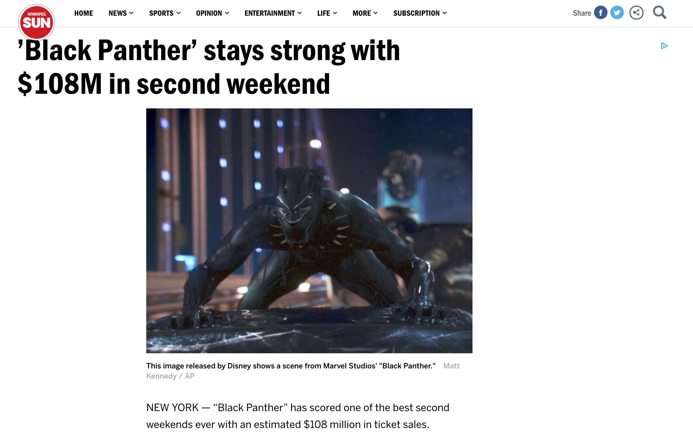
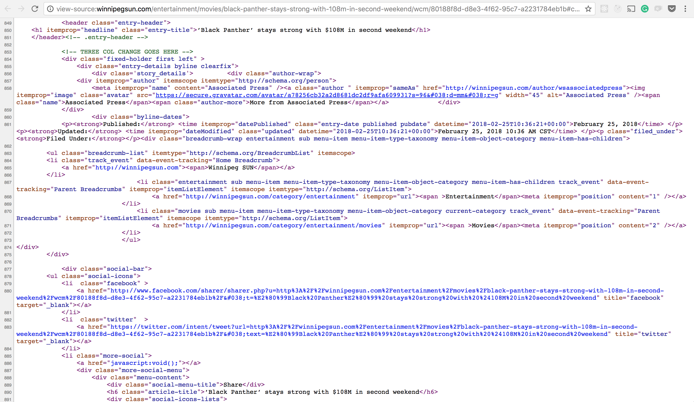

# HTML

[<- Go Back](git.md)

## What is HTML?

[Wikipedia definition:](https://en.wikipedia.org/wiki/HTML)

> `Hypertext Markup Language (HTML)` is the standard **markup language** for creating web pages and web applications.

* Web browsers receive HTML documents from a web server or from local storage and render them into multimedia web pages. 

> **HTML describes the structure of a web page**.

[Markup Language Wikipedia definition:](https://en.wikipedia.org/wiki/Markup_language)

* The current HTML version is [HTML5](https://en.wikipedia.org/wiki/HTML5)

> A markup language is a system for annotating a document in a way that is syntactically distinguishable from the text. Instructions are expressed directly by tags.

Open the [following news](http://winnipegsun.com/entertainment/movies/black-panther-stays-strong-with-108m-in-second-weekend/wcm/80188f8d-d8e3-4f62-95c7-a2231784eb1b) and define the different parts of the document structure.

Looks like this document has the following sections:

* A main title: ’Black Panther’ stays strong with $108M in second weekend
* A picture
* A picture description: This image released by Disney shows a scene from Marvel Studios' "Black Panther." Matt Kennedy / AP

* Secondary title: NEW YORK — “Black Panther” has scored one of the best second weekends ever with an estimated $108 million in ticket sales.
* Text:
Studio estimates Sunday say “Black Panther” is still performing as one of the top blockbusters of all time. This weekend’s result makes Ryan Coogler’s Marvel sensation only the fourth film to earn $100 million in its second weekend, along with “Star Wars: The Force Awakens,” “Jurassic World” and “The Avengers.”
Of those, only “The Force Awakens” had a better second weekend.
In two weeks of release, “Black Panther” has grossed $400 million domestically and $704 million worldwide.
Of new releases, faring the best is the Warner Bros. comedy “Game Night,” starring Jason Bateman and Rachel McAdams. It debuted with $16.6 million.
The well-reviewed sci-fi thriller “Annihilation” opened with $11 million.
* Comments section: 0 Comments
* Share your thoughts 
* Featured Articles title 
* Comments form 
* Finally, this is how the news HTML code looks like: 

## Tag Structure

* As HTML is a markup language we'll use tags to create HTML elements that will show the user the different document sections and content.
* A tag will have the following parts:
  * The `<` character defines the initial part of our tag
  * Then well add the `tagname` that we want to use
  * At the end we'll use the `>` character
  * We can call this void or empty element as it doesn't have any content
  ```html
  <tagname>
  ```

* There're other tags that will have content
* To add content we just write it after the `>` character

  ```html
  <tagname>Content of our tag
  ```

* In this case the first tag is working as an opening one
* We need to close this structure to let the browser know that we finished definening this structure
* Closing tags are pretty similar to the opening ones but with a minor difference
* Add a `/` character after the `<` and the tagname

  ```html
  <tagname>Content of our tag</tagname>
  ```

* We can write this in a different format too
* Using [identation](https://en.wikipedia.org/wiki/Indentation_(typesetting)) it's a good practice when we code as it allows us to see complex structures in a simpler way

  ```html
  <tagname>
    Content of our tag
  </tagname>
  ```

* We have 2 different types of tags:
  * Void or empty - just 1 tag
  * With content - need the opening and closing tags

### Tag attribute
* Tag attributes are additional values that configure the tags or adjust their behavior in various ways to meet the criteria the users want.
* The attributes will have an attribute name and a value
  ```html
  attribute="value"
  ```
* Attributes are part of the tag

  ```html
  <tagname attribute="value">

  <tagname attribute="value">Content of our tag</tagname>
  ```

* HTML defines elements attributes
* Some attributes are global
* The **id** attribute allow us to unique identify an element in a document
* We can add an id attribute to any HTML element
* There must only one element by id

  ```html
  <tagname id="first-element">
  <tagname id="second-element">Content of our tag</tagname>
  ```

* The **class** attribute accepts a CSS class name
* We can use the class attribute to identify many elements by the same criteria

  ```html
  <tagname class="red">Text in red</tagname>
  <tagname class="red">Text in red</tagname>
  <tagname class="red">Text in red</tagname>
  <tagname class="red">Text in red</tagname>
  <tagname class="red">Text in red</tagname>
  ```

### Tag with tags!
* Also, we can have tags as content from other tags:

  ```html
  <tagname>
    <tagname>Hi I'm a title</tagname>
    <tagname>
  </tagname>
  ```

* Using tags inside other tags we can create more complex structures
* This looks great but it doesn't make sense as all the tags have the same name

## HTML Tags
* Now that we know how tags works we only need to know the HTML tags names and attributes
* Check the MDN site to se a complete list of [HTML elements reference](https://developer.mozilla.org/en-US/docs/Web/HTML/Element)

## HTML document structure
* The first tag we'll learn is the DOCTYPE tag
* It's an empty tag as it doesn't have content
* By using this tag the browser knows the version of HTML that we are using
* The browser won't render this tag

### HTML5 Doctype
```html
<!DOCTYPE html>
```
### HTML
* The **html** element represents the root (top-level element) of an HTML document, so it is also referred to as the root element. All other elements must be descendants of this element.
* [MDN html doc](https://developer.mozilla.org/en-US/docs/Web/HTML/Element/html)

```html
<html></html>
```

### HEAD
* The **head** element provides general information (metadata) about the document, including its title and links to its scripts and style sheets.
* [MDN head doc](https://developer.mozilla.org/en-US/docs/Web/HTML/Element/head)

```html
<head></head>
```

### Title
* The Title element defines the title of the document, shown in a browser's title bar or on the page's tab. It can only contain text, and any tags contained within are ignored.
* It's part of the **head** element
* [MDN title doc](https://developer.mozilla.org/en-US/docs/Web/HTML/Element/title)

```html
<head>
  <title>Document title!</title>
</head>
```

### BODY
* The **body** Element represents the content of an HTML document. There can be only one <body> element in a document.
* We can write any content or other HTML elements between the html tags
* [MDN body doc](https://developer.mozilla.org/en-US/docs/Web/HTML/Element/body)

```html
<body></body>
```

### Basic HTML file

**Example:**
```html
<!DOCTYPE html>
<html>
  <head>
    <title>Document title</title>
  </head>
  <body>
    Text inside the HTML body tag
  </body>
</html>
```

#### Practice
[Exercise 1](exercises/html/ex_01.md)

### Heading Elements
* HTML has 6 title levels
* The title tag name is the letter **h** and the title number (h1, h2, h3, h4, h5, h6)
* By default the browser will show the h1 much bigger than the h6
* It's a good practice to respect the titles order by Hierarchy
* [MDN heading elements doc](https://developer.mozilla.org/en-US/docs/Web/HTML/Element/Heading_Elements)

**Example:**
```html
<h1>Main title</h1>
<h2>Secondary title</h2>
<h3>Other title</h3>
<h4>Other title</h4>
<h5>Other title</h5>
<h6>Other title</h6>
```

### Paragraph
* The **p** tagname represents a paragraph
* This tag accepts content so we'll have an open and close tags
* The paragraph tag is a `block element`
* By default the browser will show block elements one below the other
* The browser will render only a space character even if we write many
* We can use &nbsp; [HTML entity](https://developer.mozilla.org/en-US/docs/Glossary/Entity) to display the space character
* [MDN paragraph doc](https://developer.mozilla.org/en-US/docs/Web/HTML/Element/p)

**Example**
```html
<p>Paragraph content.</p>
<p>Paragraph          content.</p>
<p>Text with some &nbsp;&nbsp;&nbsp;&nbsp;&nbsp; spaces</p>
```

#### Practice
[Exercise 2](exercises/html/ex_02.md)

## Containers
### Div
* The  content division element **div** is the generic container
* This tag has no effect on the content or layout until styled using CSS
* It's used to group content so it can be easily styled
* By default this is a `block element` and begin on new lines
* [MDN div doc](https://developer.mozilla.org/en-US/docs/Web/HTML/Element/div)

#### Span
* The **span** element is a generic `inline` container for phrasing content, which does not inherently represent anything. 
* It can be used to group elements for styling purposes
* Inline elements can start anywhere in a line

**Example:**
```html
<span>This is a inline element</span>
<span>Next element inline and it's right next the previous one</span> 
<p>This paragraph has a <span>section</span></p>
```

### Inline vs Block elements
* `block-level` elements may contain `inline elements` and other `block-level elements`. 
* Inherent in this structural distinction is the idea that block elements create "larger" structures than inline elements.
* `Inline elements` are those which only occupy the space bounded by the tags defining the element, instead of breaking the flow of the content.
* Generally, inline elements may contain only data and other inline elements. You can't put block elements inside inline elements.
* By default, inline elements do not force a new line to begin in the document flow. Block elements, on the other hand, typically cause a line break to occur (although, as usual, this can be changed using CSS).
* [MDN Block-level_elements](https://developer.mozilla.org/en-US/docs/Web/HTML/Block-level_elements)
* [MDN Inline_elements](https://developer.mozilla.org/en-US/docs/Web/HTML/Inline_elements)

### Comments
* In most programming languages, there is a mechanism available to write comments in the code
* Comments are ignored by the browser and are invisible to the user
* Their purpose is to allow you to include comments in the code to say how your code works, what the different parts of the code do, etc. 
* We can write inline or multiline comments

**Example:**
```html
<!-- Inline comment -->

<!-- 
  Multiline Comment
  Multiline Comment
  Multiline Comment
  Multiline Comment
  Multiline Comment
  Multiline Comment
-->

<!-- <p>The browser won't render this paragraph</p> -->
```

### Line Break
* The **br** element produces a line break in our text (carriage-return)
* It is useful where the division of lines is significant
* [MDN br doc](https://developer.mozilla.org/en-US/docs/Web/HTML/Element/br)

**Example:**
```html
<p>This text will have a line break<br> and then we keep on writing</p>
<br>
<br>
<p>We can use a line break in any <br> part of our documents body</p>
```

### Horizontal Rule
* The **hr** element represents a thematic break between paragraph-level elements
* It has been presented as a horizontal rule or line
* [MDN hr doc](https://developer.mozilla.org/en-US/docs/Web/HTML/Element/hr)

**Example:**
```html
<h1>Main title</h1>
<h2>Subtitle</h2>
<hr>
<p>Rest of the content</p>
```

#### Practice
[Exercise 3](exercises/html/ex_03.md)

### Text Format
* HTML has some tags to describe how the text should be
* The **strong** element indicates that its contents have strong importance, seriousness, or urgency. 
* Browsers typically render the contents in bold type.
* Remember that we'll use CSS for **bold font weight**

**Example:**
```html
<strong>This is a very important text!!</strong>
```

## Lists
* As web developers we'll use lists for many different things 
* HTML has 3 different list types:
  * Unordered
  * Ordered
  * Description or definition

### Unordered list
* The **ul** element represents an unordered list of items
* By default it will be rendered as a bulleted list
* We'll use this type of list when we don't care about items order
* Each item is a list item or **li** element
* [MDN ul doc](https://developer.mozilla.org/en-US/docs/Web/HTML/Element/ul)
* [MDN li doc](https://developer.mozilla.org/en-US/docs/Web/HTML/Element/li)

**Example:**
```html
<ul>
  <li>First List Item</li>
  <li>Second List Item</li>
  <li>Third List Item</li>
</ul>
```

### Ordered list
* The **ol** element represents an ordered list of items
* By default it will be rendered as a numbered list
* We'll use this type of list when we care about the items order
* This type of list also accepts **li** elements as children
* [MDN ol doc](https://developer.mozilla.org/en-US/docs/Web/HTML/Element/ol)

**Example:**
```html
<ol>
  <li>Order Item</li>
  <li>Order Item</li>
  <li>Order Item</li>
</ol>
```

### Description or definition list
* The **dl** element represents a description list
* The element encloses a list of groups of terms (**dt** element) and descriptions (**dd** elements) 
* Common uses for this element are to implement a glossary or to display metadata (a list of key-value pairs)
* [MDN dl doc](https://developer.mozilla.org/en-US/docs/Web/HTML/Element/dl)
* [MDN dt doc](https://developer.mozilla.org/en-US/docs/Web/HTML/Element/dt)
* [MDN dd doc](https://developer.mozilla.org/en-US/docs/Web/HTML/Element/dd)

**Example:**
```html
<dl>
  <dt>Term</dt>
  <dd>Definition</dd>
</dl>
```

### Nested list
* List can be nested inside list items
* We can use any list type
* Very helpful and used to create sites menus adding CSS


**Example:**
```html
<ul>
  <li>Unordered list item</li>
  <li>
    <ol>
      <li>Order list item</li>
      <li>Order list item</li>
      <li>Order list item</li>
    </ol>
  </li>
</ul>
```
#### Practice
[Exercise 4](exercises/html/ex_04.md)


## Hyperlink
* The **a** element (or anchor element) creates a hyperlink to other web pages, files, locations within the same page, email addresses, or any other URL.
* This element has a **href** attribute that contains a URL or a URL fragment that the hyperlink points to
* Between the opening and the closing tag we can add the link content that the user will click on
* As content we can put other HTML elements like an image tag
[](https://developer.mozilla.org/en-US/docs/Web/HTML/Element/a)

**Example:**
```html
<a href="other_file.html">Click me I'm a link!!</a>
<a href="my_dog.jpg">Link to my dog picture</a>
<a href="video.avi">Link to my video</a>
```

### External links
* In some cases we need to link our HTML documents with external files or other resources
* We can do this by using the external URL's as **href** values

**Example:**
```html
<a href="http://google.com">Go to google.com</a>
```

### Target attribute
* The **a** has a target attribute that specifies where to display the linked URL.
* The following keywords have special meanings:
  * **_self**: Load the URL into the same browsing context as the current one. This is the default behavior.
  * **_blank**: Load the URL into a new browsing context. This is usually a tab, but users can configure browsers to use new windows instead.
  * **_parent**: Load the URL into the parent browsing context of the current one. If there is no parent, this behaves the same way as _self.
  * **_top**: Load the URL into the top-level browsing context (that is, the "highest" browsing context that is an ancestor of the current one, and has no parent). If there is no parent, this behaves the same way as _self.
* For now we'll use only **_blank** as it's the one we use the most

**Example:**
```html
<a href="http://www.comit.org" target="_blank">ComIT</a>
<a href="http://www.comunidadit.org" target="_blank">Comunidad IT</a>
```

### Absolute & relative URLs
* We can define `absolute or relative` Urls
* Let's check this [MDN URL guide](https://developer.mozilla.org/en-US/docs/Learn/Common_questions/What_is_a_URL) to understand better what's and absolute URL

**Example:**
```html
<a href="http://yahoo.com">Abrir Yahoo</a>
<a href="c:\Users\my_name\my_cv.pdf">Look at my CV</a>
```

* Links can have a relative URL or path
* In this type of URLs we need to know the relationship between files
* To access to the root of our site we can use the following relative path
* Absolute and relatives URLs and Paths will work with any element that need an URL or path to work (imgs, video, audio and more)

**Example:**
```html
<a href="/">Go Home</a>
```

```
/ (root of our folder)
|
|-- index.html
|-- about.html

```

* If we have to files that are siblings or in the same path level we can use the filename as link

**Example:**
```html
To link index.html with about.html
<a href="about.html">About</a>

To link about.html with index.html
<a href="index.html">Go Home</a>

As index is the main file in our site we could use the root
<a href="/">Go Home</a>
```

```
/ (root of our folder)
|-- about/
|   |--- about.html
|
|-- index.html
```

* To link a file that it's inside a folder we'll use the **foldername/filename**

**Example:**
```html
To link index.html with the about.html
<a href="about/about.html">About</a>
```

* Also we can link files from inside a folder to another that's outside
* We will add as many **../** as folders we need to exit

**Example:**
```html
To link about.html to index.html first we need to exit the about folder
<a href="../index.html">Go home</a>
```

```
/ (root of our folder)
|-- about/
|   |-- other_folder/
|     |--- about.html
|
|-- index.html
```

**Example:**
```html
With this folder structure:
To link from index.html to about.html we'll use both folder names
<a href="about/other_folder/about.html">About</a>

To link about.html to index.html we need to exit 2 folders (../../filename)
<a href="../../index.html">Go home</a>
```

* [absolute vs relative pathslinks](https://www.coffeecup.com/help/articles/absolute-vs-relative-pathslinks)
* [What are hyperlinks](https://developer.mozilla.org/en-US/docs/Learn/Common_questions/What_are_hyperlinks)
* [Creating hyperlinks](https://developer.mozilla.org/en-US/docs/Learn/HTML/Introduction_to_HTML/Creating_hyperlinks)
* [Dealing with files](https://developer.mozilla.org/en-US/docs/Learn/Getting_started_with_the_web/Dealing_with_files)

## Mailto
* We can use links to configure to send an email
* The browser will try to open the default email app if we set the **href** value to **mailto:account@domain.com**

```html
<a href="mailto:pablo@comit.org">Contact me</a>
```

### Anchor
* We can use links to navigate to anchor points and into a selected document part
* If the URL has an anchor the browser will lookup for that document section
* To accomplish this task we need to combine the **a** element and **href**, **name** attributes
* The **#** works as anchor symbol (remember the URLs MDN guide)

**Example**
```html
First we'll create a link with the anchor href
<a href="#news">News Section</a>

Then we need to create the anchor by using the name attribute
<a name="news"></a>

We created an empty link with the news attribute. As they are on the same document the browser will try to
navigate to the news anchor.

To be able to see this magic working we need to create long documents

Also we can navigate to a different document section:
<a href="news.html#nhl">NHL news section</a>
```

#### Practice
[Exercise 5](exercises/html/ex_05.md)

[Exercise 6](exercises/html/ex_06.md)

## Images
* The **img** element embeds an image into the document
* It's only a one tag element as it doesn't allow content (other elements or text)
* The **src** attribute accepts an image filename / path
* The **img** is an inline element
* By default the placeholder will have the image size
* We must use optimized images to avoid big files
* The browser knows how to render different image types: [jpg](https://es.wikipedia.org/wiki/Joint_Photographic_Experts_Group), [png](https://es.wikipedia.org/wiki/Portable_Network_Graphics) & [gif](https://es.wikipedia.org/wiki/Graphics_Interchange_Format)
* [Image optimization - Google Developers](https://developers.google.com/web/fundamentals/performance/optimizing-content-efficiency/image-optimization)
* [MDN img doc](https://developer.mozilla.org/en-US/docs/Web/HTML/Element/img)

**Example**
```html

```

* We can use absolute or relative paths/urls as **src** value

**Example**
```html
Relative example:


Go one folder level back, then enter the img folder and get mypicture file


Absolute URL:

```

* The **img** has a **height** and **width** attribute
* This attributes accepts the intrinsic width & height of the image in pixels
* HTML5 doesn't accept other types of values
* Keep in mind the image ratio when using this attributes

```html

```
* The **alt** attribute defines the alternative text describing the image. 
* Users will see this text displayed if the image URL is wrong, the image is not in one of the supported formats, or if the image is not yet downloaded.
* Also, screen readers will use this attribute to describe the image
* Adding this attribute to our images is a good practice

**Example**
```html

```

* We can also add a global attribute to our images to describe it better
* The title contains a text representing advisory information related to the element it belongs to. 
* Such information can typically, but not necessarily, be presented to the user as a tooltip.

**Example**
```html

```
* [Image alt vs title - Using alt title attributes in image tags](https://www.wpromote.com/blog/image-alt-vs-title-using-alt-title-attributes-in-image-tags)

### Figure & Figure caption
* the **figure** element represents self-contained content, frequently with a caption (**figcaption**), and is typically referenced as a single unit.
* As **figure** content we'll add an image (**img**) and a caption (**figcaption**) elements
* Older browser won't know how to show this element but they will render the image
* [MDN figure doc](https://developer.mozilla.org/en-US/docs/Web/HTML/Element/figure)
* [Test your browser](https://html5test.com)

**Example**
```html
<figure>
  
  <figcaption>Developers working on a new project</figcaption>
</figure>
```

#### Practice
[Exercise 7](exercises/html/ex_07.md)

## Table
* The **table** element represents tabular data — that is, information presented in a two-dimensional table comprised of rows and columns of cells containing data
* Our table will have rows (table rows or **tr**) and columns (table data or **td**) 
* [MDN table doc](https://developer.mozilla.org/en-US/docs/Web/HTML/Element/table)
* [MDN tr doc](https://developer.mozilla.org/en-US/docs/Web/HTML/Element/tr)
* [MDN td doc](https://developer.mozilla.org/en-US/docs/Web/HTML/Element/td)

**Example**
```html
<table>
  <tr>
    <td>1</td>
    <td>2</td>
  </tr>
  <tr>
    <td>3 </td>
    <td>4</td>
  </tr>
</table>
```

* In this example will see a table with 1 and 2 on the first row and 3 and 4 in the second one
* If we need to have an empty cell we still need to add it as part of the table

**Example**
```html
<table>
  <tr>
    <td>1</td>
    <td>2</td>
  </tr>
  <tr>
    <td>3 </td>
    <td></td>
  </tr>
</table>
```

#### Practice
[Exercise 8](exercises/html/ex_08.md)

* Also we can use a **th** to define a cell as header
* [MDN th doc](https://developer.mozilla.org/en-US/docs/Web/HTML/Element/th)

**Example**
```html
<table>
  <tr>
    <th>Name</th>
    <th>Last Name</th>
  </tr>
  <tr>
    <td>Dale</td>
    <td>Hawerchuk</td>
  </tr>
</table>
```

* We can use the following elements to define table sections: **thead, tbody & tfoot**
* The **thead** element defines a set of rows defining the head of the columns of the table
* The **tbody** encapsulates a set of table row (**tr** elements, indicating that they comprise the body of the table)
* The **tfoot** element defines a set of rows summarizing the columns of the table
* A well structured table has all 3 sections
* This is also useful for the screen readers
* We can combine the **thead** and **th** element

**Example**
```html
<table>
  <thead>
    <tr>
      <th>Header 1 - 1</th>
      <th>Header 1 - 2</th>
    </tr>
  </thead>
  <tbody>
    <tr>
      <td>Body 1 - 1</td>
      <td>Body 1 - 2</td>
    </tr>
    <tr>
      <td>Body 2 - 1</td>
      <td>Body 2 - 2</td>
    </tr>
  </tbody>
  <tfoot>
    <tr>
      <td>Foot 1 - 1</td>
      <td>Foot 1 - 2</td>
    </tr>
  </tfoot>
</table>
```

#### Practice
[Exercise 9](exercises/html/ex_09.md)

