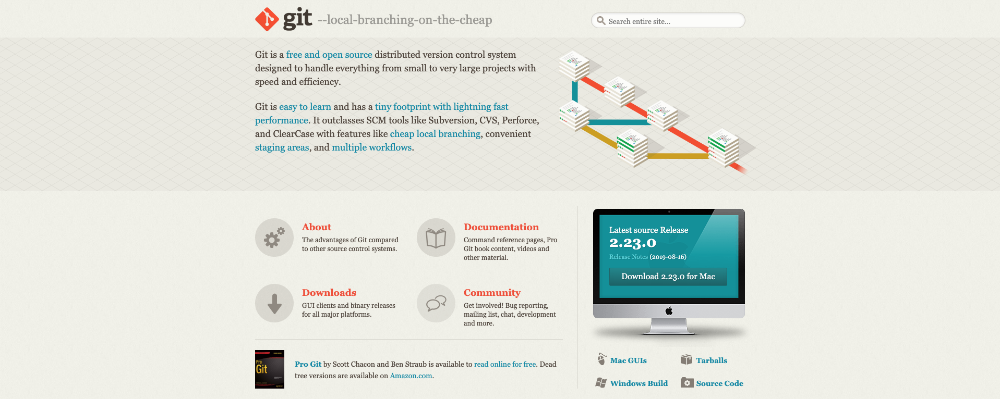

# Introduction to Development

[<- Go Back](README.md)

## Installing Git

Git is a version control system that we'll use to save changes and deploy our app. We need to install Git! 

1. Visit the URL https://git-scm.com/. 
2. Select your operating system. 
3. Follow the prompts to install Git! 
4. If Git asks you which default editor to use, we recommend Visual Studio Code!

## Visual Studio Code

### Key Advantages of Visual Studio Code

Visual Studio Code is a simple, code-centric integrated development environment (IDE). 

- Available for Mac, Linux, and Windows 
- Key features include debugging, version control with Git, and intelligent code completion 
- Supports 36 programming languages and offers customized tools and plug-ins to make your dev environment your own! 

### Download Visual Studio Code

1. Go to [Visual Studio Code](https://code.visualstudio.com/)
2. Click the big **"Download for xxx"** button  *If you're having trouble, scroll to the bottom of the page and manually select the correct package for your system* 

3. Open the VSCode .zip file after it has finished downloading to set up Visual Studio Code. Your browser may let you open the file directly from the download page...  ...or you may have to open your Downloads folder and select the .zip file: 

## What's Web Development?

### Front End, or Client-Side: 
* Directly user-interactive website parts
* Technologies
  * HTML: Content
  * CSS: Layout
  * Javascript: Interaction

### Back End, or Server-Side:
* User-hidden functionality.
* Basically any language, like Node.js, Ruby and Python

*NOTE: Full Stack developer: Someone who is familiar with both kinds of development, and can work on a website from start to finish!*

## Let's learn more about the internet
* [<- Home](README.md) - [Internet ->](internet.md) 