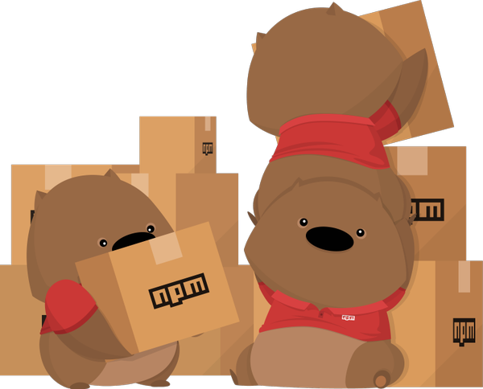

# Node.js

[<- Go Back](browser.md)

* Node.js allows us to run JavaScript in different environments and run different tasks
* Using Node we can:
  * Run a simple script (like our exercises)
  * Bundle our front-end code and assets using different cool modules
  * Run a web server
  * Create back-end apps using different databases
* Over this course section we'll focus on using Node.js to create a web server and create a back-end app
* We'll create dynamic documents
* When we installed Node.js we also installed other program called NPM

## NPM
* NPM used to stand for Node Package Manager but nowadays it's just known as "NPM"
* Thanks to NPM we can install many different Node.js modules and import them into our projects
* This way we reuse code and we can contribute to other modules too
* NPM is one of the largest modules repository 
* Visit [NPM site](https://www.npmjs.com) to learn more about it
* Also learn more reading [NPM blog](https://blog.npmjs.org)
* Also, they have the best mascot ever.. NPM wombat!!

  

### Start a new NPM project
* To start a new project first we need to create a new folder and change directory to go inside of it
* You can do this in unix like systems

  ```
  mkdir learning-node
  cd learning-node
  ```

* Once we're in the right folder we run the NPM command `init`
* This command asks a lot of questions to configure our project
* We can ignore them and just press enter
* [NPM init doc](https://docs.npmjs.com/cli/init)

  ```bash
  npm init
  ```

* Or we can generate it without having to answer the questions

  ```bash
  npm init -y
  ```

* This script creates a new package.json file that allows us to configure our project
* Just looking at the file extension we can figure out that we'll use JSON for our npm configuration file

  ```js
  {
    "name": "learning-node",
    "version": "1.0.0",
    "description": "",
    "main": "index.js",
    "scripts": {
      "test": "echo \"Error: no test specified\" && exit 1"
    },
    "author": "",
    "license": "ISC"
  }
  ```

* NPM init uses our answers to create the configuration file based on our answers
* Once we have the file we can update any value on it

### NPM scripts
* In the **package.json** file we can find a **scripts** key
* By default we have a test script
* We can create our own scripts
* Add a **start** script

  ```js
  "scripts": {
    "test": "echo \"Error: no test specified\" && exit 1",
    "start": "node index.js"
  },
  ```

* Now we can run this command from our command line

  ```bash
  npm start
  ```

* At this point we get an error

  ```bash
  Error: Cannot find module 'index.js'
  ```

* We get this error as we try to execute index.js script and node can't find it
* As we are calling `node index.js` we need to create this new file at the same package.json or root level
* Update the start script definition if you need to move index.js to a different project/folder structure
* Create index.js and add the following code

  **index.js**
  ```js
  console.log('Welcome to JavaScript and Node.js server side');
  ```

* Run the npm start command again

  ```bash
  npm start

  Welcome to JavaScript and Node.js server side
  ```

* Now we know how to create, configure and run scripts using NPM and Node

### Install NPM module
* Using NPM we can install modules and use them on our projects
* Run **npm install** and the module name to install the given module
* You can check and search for modules on the [NPM site](https://www.npmjs.com)
* In this case we're going to install **Express** which is a popular module to create a web server
* A web server is the magic that gives you a web page when you ask the internet for one :)
  * If you are interested in knowing more, [here](https://developer.mozilla.org/en-US/docs/Learn/Common_questions/What_is_a_web_server) is a good place to start
* Check out [express npm page](https://www.npmjs.com/package/express)
* Also, take a look at [express site and doc](http://expressjs.com)

  ```bash
  npm install express
  ```

  **package.json**
  ```js
  "dependencies": {
    "express": "^4.16.3"
  }
  ```

* Running NPM install creates a **node_modules** folder
* Inside **node_modules** we find all the installed modules for a given project
* This folder can grow in size as we can have many installed modules or dependencies
* To avoid having issues we can [.gitignore](https://git-scm.com/docs/gitignore) this folder
* So if we're not sharing the node_modules folder with other team members... do we need to remember the list of installed modules?
* By default now NPM installs the modules and add them to our package.json dependencies
* Delete the node_modules folder
* Run the npm install command but without the module name

  ```bash
  npm install
  ```

* NPM reads our list of dependencies, downloads and install all the modules for us
* In this case we have only Express as dependency
* In many cases we need dependencies that are only for development purposes like for example a library to run our tests, build our bundle or deploy our project
* NPM supports devDependencies that are modules that we don't deploy on our server
* To install a devDependencies we run npm install and add --save-dev as command parameter
* By default npm install now runs `npm install --save` to save the module as dependency
* Lets install a dev dependency called [UglifyJS](https://github.com/mishoo/UglifyJS2)

  ```
  npm install uglify-js --save-dev
  ```

* Open package.json to see the installed dependecy

  ```json
  "devDependencies": {
    "uglify-js": "^3.3.25"
  }
  ```

* Now we have express installed as dependency and uglify.js as dev dependency
* Delete the node_modules and run npm install again to make sure that npm install both dependencies
* Lets configure uglify.js to run as script
* Add the following script to your package.json file

  ```json
  "uglify": "uglifyjs index.js --output script.js"
  ```

* Open index.js and replace the console.log() for the following code

  ```js
  var firstname = 'Ciro';
  var lastname = 'Rodriguez';
  var age = 20;

  console.log(firstname);
  console.log(lastname);
  console.log(age);
  ```

* Now run the following npm command

  ```bash
  npm run uglify
  ```

* When running this command you'll see the following output: `> uglifyjs index.js --output script.js`
* NPM has configured some scripts names as shortcuts like start and test
* When we need to run our own scripts we need to use `npm run scriptname`
* NPM can execute the code configured on this script as uglify.js is installed in the node_modules folder
* NPM can access installed node_modules modules
* Open the generated script.js file 

  **script.js**
  ```js
  var firstname="Ciro";var lastname="Rodriguez";var age=20;constole.log(firstname);constole.log(lastname);constole.log(age);
  ```

* Uglify.js does a lot of things to bundle our code
* Uglify removes all the spaces as we need to create a smaller file so it takes less time to download
* This file is prepared to be deployed and not to read
* The index.js file still has our code and that it's more readable
* We don't need uglify.js as dependency as we prepare our files before we deploy them
* This is why we can install it as devDependency
* NPM can also uninstall packages running the uninstall command
* First we'll install a new module so we can then test this new command
* Install [Morgan.js](https://github.com/expressjs/morgan)

  ```bash
  npm install morgan
  ```

* Check the package.json file

  ```json
  "dependencies": {
    "express": "^4.16.3",
    "morgan": "^1.9.0"
  },
  ```

* Now run npm uninstall with the module name that you want to remove

  ```bash
  npm uninstall morgan
  ```

* After running npm uninstall your package.json should only have express as dependency

  ```json
  "dependencies": {
    "express": "^4.16.3"
  },
  ```

* All this modules has been installed as local dependencies
* NPM can also install modules as global so we can run them as programs from anywhere
* To install a module as global we also run npm install but we add the **-g** parameter
* For example when we installed [http-server](https://github.com/indexzero/http-server) we installed it as global so we can use it from any folder

  ```bash
  npm install http-server -g
  ```

* As we're going to create a web server and we already have express installed we could start coding it
* Express is a really flexible module but we want to add some structure to our project
* Install [express-generator](https://github.com/expressjs/generator) as a global module

  ```bash
  npm install express-generator -g
  ```

* To make sure that the module has been installed run the following command:

  ```bash
  express --help
  ```

* If you get an error running the previous command try closing and opening your terminal again
* Sometimes you need to restart your terminal so the terminal notice that there's other modules installed (not so common but it might happen)
* Now you should get the following output

  ```bash
  Usage: express [options] [dir]

  Options:

    -h, --help           output usage information
        --version        output the version number
    -e, --ejs            add ejs engine support
        --pug            add pug engine support
        --hbs            add handlebars engine support
    -H, --hogan          add hogan.js engine support
    -v, --view <engine>  add view <engine> support (dust|ejs|hbs|hjs|jade|pug|twig|vash) (defaults to jade)
    -c, --css <engine>   add stylesheet <engine> support (less|stylus|compass|sass) (defaults to plain css)
        --git            add .gitignore
    -f, --force          force on non-empty directory
  ```

* As we're learning express lets add our own structure and uninstall this module
* We can add it later if we really need it

  ```bash
  npm uninstall express-generator -g
  ```

* As you can see NPM is a great package module and will help us install and uninstall regular or dev dependencies

## Modules
* A module is just a way to encapsulate our code in a single code unit
* This means that we'll organize our code by functionality and create our own modules too
* Node.js by default has a module loader that we can use
* We can create a single file and use it as module in our project
* The **require** function accepts a string as parameter with the name of the module that we want to get
* Require will look into the node_modules folder to see if we have that module installed

  ```js
  const module = require('modulename');
  ```

* We can also use relative paths to load our modules

  ```bash
  /
  |- index.js
  |- my-module.js
  ```

* For example if we have the index.js file and my-module.js we can load the my-module from the index one in the following way

  ```js
  const module = require('./my-module');
  ```

* As both files are siblings we can use `./` to let node node know that the my-module module is at the same level
* Also, you can see that we're not using `.js` as my module extension
* By default require will look for a JavaScript file

### Using modules
* As we have express installed as module we can require it from our project
* Delete all the `index.js` content and add the following one

  ```js
  const express = require('express')
  console.log(express)
  ```

* Now run npm start 

  ```bash
  npm start
  ```

  ```bash
  { [Function: createApplication]
    application:
    { init: [Function: init],
      defaultConfiguration: [Function: defaultConfiguration],
      lazyrouter: [Function: lazyrouter],
      handle: [Function: handle],
      use: [Function: use],
      route: [Function: route],
      engine: [Function: engine],
      param: [Function: param],
      set: [Function: set],
      path: [Function: path],
      enabled: [Function: enabled],
      disabled: [Function: disabled],
      enable: [Function: enable],
      disable: [Function: disable],
      acl: [Function],
      bind: [Function],
      checkout: [Function],
      connect: [Function],
      copy: [Function],
      delete: [Function],
      get: [Function],
      head: [Function],
      link: [Function],
      lock: [Function],
      'm-search': [Function],
      merge: [Function],
      mkactivity: [Function],
      mkcalendar: [Function],
      mkcol: [Function],
      move: [Function],
      notify: [Function],
      options: [Function],
      patch: [Function],
      post: [Function],
      propfind: [Function],
      proppatch: [Function],
      purge: [Function],
      put: [Function],
      rebind: [Function],
      report: [Function],
      search: [Function],
      subscribe: [Function],
      trace: [Function],
      unbind: [Function],
      unlink: [Function],
      unlock: [Function],
      unsubscribe: [Function],
      all: [Function: all],
      del: [Function],
      render: [Function: render],
      listen: [Function: listen] },
    request:
    IncomingMessage {
      header: [Function: header],
      get: [Function: header],
      accepts: [Function],
      acceptsEncodings: [Function],
      acceptsEncoding: [Function],
      acceptsCharsets: [Function],
      acceptsCharset: [Function],
      acceptsLanguages: [Function],
      acceptsLanguage: [Function],
      range: [Function: range],
      param: [Function: param],
      is: [Function: is],
      protocol: [Getter],
      secure: [Getter],
      ip: [Getter],
      ips: [Getter],
      subdomains: [Getter],
      path: [Getter],
      hostname: [Getter],
      host: [Getter],
      fresh: [Getter],
      stale: [Getter],
      xhr: [Getter] },
    response:
    ServerResponse {
      status: [Function: status],
      links: [Function],
      send: [Function: send],
      json: [Function: json],
      jsonp: [Function: jsonp],
      sendStatus: [Function: sendStatus],
      sendFile: [Function: sendFile],
      sendfile: [Function],
      download: [Function: download],
      type: [Function: contentType],
      contentType: [Function: contentType],
      format: [Function],
      attachment: [Function: attachment],
      append: [Function: append],
      header: [Function: header],
      set: [Function: header],
      get: [Function],
      clearCookie: [Function: clearCookie],
      cookie: [Function],
      location: [Function: location],
      redirect: [Function: redirect],
      vary: [Function],
      render: [Function: render] },
    Route: [Function: Route],
    Router:
    { [Function]
      param: [Function: param],
      handle: [Function: handle],
      process_params: [Function: process_params],
      use: [Function: use],
      route: [Function: route],
      acl: [Function],
      bind: [Function],
      checkout: [Function],
      connect: [Function],
      copy: [Function],
      delete: [Function],
      get: [Function],
      head: [Function],
      link: [Function],
      lock: [Function],
      'm-search': [Function],
      merge: [Function],
      mkactivity: [Function],
      mkcalendar: [Function],
      mkcol: [Function],
      move: [Function],
      notify: [Function],
      options: [Function],
      patch: [Function],
      post: [Function],
      propfind: [Function],
      proppatch: [Function],
      purge: [Function],
      put: [Function],
      rebind: [Function],
      report: [Function],
      search: [Function],
      subscribe: [Function],
      trace: [Function],
      unbind: [Function],
      unlink: [Function],
      unlock: [Function],
      unsubscribe: [Function],
      all: [Function] },
    json: [Function: json],
    query: [Function: query],
    static:
    { [Function: serveStatic]
      mime:
        Mime {
          types: [Object],
          extensions: [Object],
          default_type: 'application/octet-stream',
          Mime: [Function: Mime],
          charsets: [Object] } },
    urlencoded: [Function: urlencoded] }
  ```

* We get a big object definition as output
* By using `require('express')` we tell node to get express code
* In this case we can assign the value that we get back from the require call `const express = require('express');`
* Node.js also has it own modules
* Take a look at [Node.js module doc](https://nodejs.org/api)

### Create your first module
* We can learn more about modules by creating our own one
* Create a `math.js` file and add the following code

  **math.js**
  ```js
  const revenew = 50;

  const priceCalculation = function(price) {
    return price + revenew;
  }

  module.exports = priceCalculation;
  ```

* Comment the express require call
* Require math module and use it from index.js

  **index.js**
  ```js
  // const express = require('express')
  // console.log(express)

  const getPrice = require('./math');
  const price = getPrice(200);

  console.log(price);
  ```

* Run the project

  ```bash
  npm start

  250
  ```

* In this example we created a module called `math`
* The math module exports a `priceCalculation` function that we can use
* This function accepts a number parameter and will return a value with the final price
* Node.js uses `module.exports` that represents an object that we can export
* Now that we have our `math` module we can `require` it from `index.js`
* As the math module it's not installed in the node_module we use the relative path to import it `require('./math')`
* We defined a variable getPrice and assign what math module is exporting
* In this case it's just a function but it could be an object or any other value
* Then we can use the getPrice function with any numeric value to get the final price
* By using this math module we calculate the final price without knowing the logic behind it
* If we need to change the way that we calculate a price we just update the math module an it will work from anywhere it's being called
* In case we need or want to share this module between project we can just publish it on the NPM repository
* NPM has public and private repositories
* Also we can link NPM modules while we develop our projects if we have them as external dependencies

### How do Node.js modules work
* Once we export our code Node.js will enclose it inside a function so the module scope is private
* Module variables and rest of the code will be private
* We only can access and use what it has been exported using `module.exports`
* Also, we can export more code using just `exports` 

  ```js
  exports = getPrice;
  ```

* Read and learn more about [Node.js modules](https://nodejs.org/api/modules.html)

#### Practice
[Exercise 1](./exercises/node/ex_1.md)

[Exercise 2](./exercises/node/ex_2.md)

[Exercise 3](./exercises/node/ex_3.md)

[Exercise 4](./exercises/node/ex_4.md)

[Exercise 5](./exercises/node/ex_5.md)
